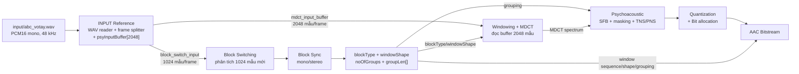
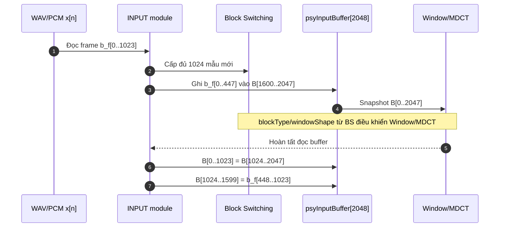
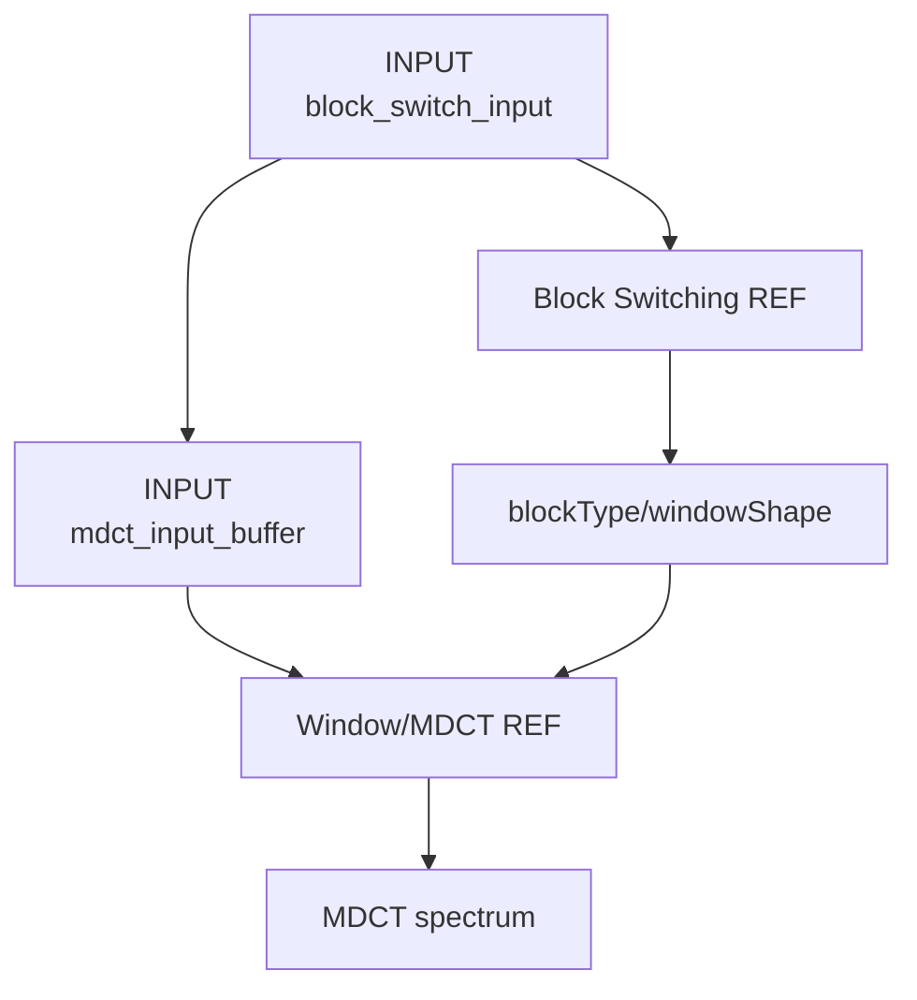

# INPUT — bộ đọc WAV và tạo stimulus cho pipeline AAC-LC

Thư mục `my_workspace/INPUT` cung cấp một Reference/Stimulus Generator cho phần
đầu pipeline AAC-LC. Module đọc WAV PCM16 mono, sau đó tạo đúng hai luồng dữ liệu
thời gian mà các core phía sau cần:

1. Frame (1024) mẫu mới cho Block Switching phân tích transient.
2. Snapshot `psyInputBuffer` (2048) mẫu cho Window/MDCT.

Module này **không** chạy Block Switching, Windowing hoặc MDCT. Nó chỉ chuẩn bị
input và ánh xạ chỉ số mẫu để các core đó có thể được chạy/kiểm chứng độc lập.

## 1. Cấu trúc thư mục

```text
my_workspace/INPUT/
├── README.md                 ← tài liệu này
├── input_pipeline_ref.cpp    ← WAV reader + mô hình psyInputBuffer
├── wav_to_fft_input.py       ← WAV PCM16 → vector phức Q1.23 cho FFT NumPy/RTL
├── .gitignore                ← bỏ qua executable và output tự sinh
└── out/                      ← được tạo khi chạy, không lưu như source
```

Input mặc định:

```text
input/abc_votay.wav
```

Output mặc định:

```text
my_workspace/INPUT/out/abc_votay/
```

## 2. Vị trí trong pipeline



Điểm quan trọng: Block Switching và Window/MDCT không đọc cùng một vùng thời
gian. Block Switching cần nhìn xa hơn để quyết định sớm `START/SHORT/STOP`, còn
MDCT xử lý cửa sổ trượt đã được trì hoãn.

## 3. Điều kiện input

Utility hiện nhận:

| Thuộc tính | Yêu cầu |
|---|---|
| Container | RIFF/WAVE |
| Codec | PCM không nén, format code 1 |
| Kênh | Mono |
| Độ rộng mẫu | Signed 16-bit little-endian |
| Frame AAC-LC | 1024 mẫu |

File `abc_votay.wav` hiện tại có:

```text
sampleRate   = 48000 Hz
channels     = 1
bitsPerSample= 16
totalSamples = 462848
fullFrames   = 452
tailSamples  = 0
```

Nếu dùng WAV stereo/float/nén, cần chuyển sang PCM16 mono trước khi chạy module.

## 4. Luồng dành cho Block Switching

Gọi (x[n]) là mẫu PCM tuyệt đối trong WAV và (G=1024) là độ dài một frame.
Input Block Switching tại frame (f) là:

$$
b_f[n] = x[fG+n], \qquad 0 \le n < G.
$$

Vì (G=1024):

$$
b_f[n] = x[1024f+n], \qquad 0 \le n < 1024.
$$

Do đó frame (f) đọc vùng:

$$
x[1024f\;..\;1024f+1023].
$$

Block Switching chia frame thành (T=8) sub-window:

$$
L_{sub}=\frac{G}{T}=\frac{1024}{8}=128\text{ mẫu}.
$$

Mỗi sub-window (w\in[0,7]) nhận:

$$
b_f[128w\;..\;128w+127].
$$

Kết quả của Block Switching sau đó là `blockType`, `windowShape`,
`noOfGroups` và `groupLen[]`. Những tín hiệu điều khiển này không do module
`INPUT` tự tạo.

## 5. Luồng dành cho Window/MDCT

### 5.1 Kích thước và offset

FDK-AAC duy trì:

$$
\texttt{psyInputBuffer}[0..2047].
$$

Với AAC-LC:

$$
G=1024,\qquad T=8.
$$

Offset chèn dữ liệu trước Block Switching/MDCT là:

$$
O=G+\frac{9G}{2T}
  =1024+\frac{9\cdot1024}{16}
  =1600.
$$

Số mẫu đầu frame được chèn trước khi MDCT chạy:

$$
2G-O=2048-1600=448.
$$

Số mẫu còn lại được chèn sau MDCT:

$$
O-G=1600-1024=576.
$$

### 5.2 Tại sao phải chèn 448 mẫu trước khi chạy MDCT?

Việc chèn tại offset 1600 không phải là thêm một khoảng trễ tùy ý vào file WAV.
Đây là bước hoàn thiện cửa sổ thời gian 2048 mẫu mà MDCT sắp đọc.

Ngay trước bước chèn của frame $f$, phép rotate ở frame trước mới chỉ bảo đảm:

$$
B_f[0..1599]=x[1024f-1600\;..\;1024f-1].
$$

Nói cách khác, buffer đã có 1600 mẫu quá khứ liên tục, nhưng 448 vị trí cuối
`B_f[1600..2047]` vẫn là dữ liệu cũ còn sót lại trong RAM. Ghi 448 mẫu đầu của
frame mới:

$$
B_f[1600..2047]\leftarrow x[1024f\;..\;1024f+447]
$$

làm cho toàn bộ input MDCT trở thành một đoạn thời gian liên tục:

$$
B_f[0..2047]=x[1024f-1600\;..\;1024f+447].
$$

MDCT cần cửa sổ dài $2G=2048$ mẫu có chồng lấn, nên không thể chỉ nhận riêng
1024 mẫu mới của frame. Nó phải giữ phần lịch sử từ các frame trước và chỉ ghép
đúng phần đầu của frame hiện tại vào cuối buffer.

Không chèn toàn bộ 1024 mẫu trước MDCT vì Block Switching và MDCT được cố ý đặt
lệch thời gian. Block Switching phải nhìn đủ:

$$
x[1024f\;..\;1024f+1023]
$$

để phát hiện transient và chọn sớm `START_WINDOW`, `SHORT_WINDOW` hoặc
`STOP_WINDOW`,
nhưng MDCT của cùng lần gọi chỉ được nhìn tới $x[1024f+447]$. Vì vậy:

- 448 mẫu đầu được chèn **trước MDCT** để hoàn thiện cửa sổ hiện tại;
- 576 mẫu còn lại vẫn được Block Switching quan sát, nhưng chỉ được đưa vào
  trạng thái buffer **sau MDCT**;
- độ lệch 576 mẫu chính là look-ahead giúp quyết định loại cửa sổ trước khi
  transient đi vào vùng biến đổi tương ứng.

Thứ tự này còn duy trì một bất biến cho frame kế tiếp. Sau khi MDCT đọc xong,
rotate 1024 mẫu và chèn 576 mẫu còn lại tạo ra:

$$
B_{f+1}[0..1599]
=x[1024f-576\;..\;1024f+1023]
=x[1024(f+1)-1600\;..\;1024(f+1)-1].
$$

Do đó frame kế tiếp lại có sẵn đúng 1600 mẫu quá khứ và chỉ cần chèn 448 mẫu
mới vào offset 1600.

Nếu bỏ hoặc thực hiện bước chèn 448 mẫu sau MDCT, phần cuối cửa sổ hiện tại sẽ
chứa dữ liệu stale, gây lặp/đứt đoạn mẫu và phổ MDCT sai. Nếu ghi cả 1024 mẫu
trước MDCT, 576 mẫu lịch sử cần giữ sẽ bị ghi đè, làm mất độ lệch thời gian với
Block Switching và không còn khớp pipeline FDK-AAC.

Ở frame đầu tiên, các chỉ số âm không có mẫu WAV tương ứng nên phần lịch sử
được điền zero. Đây mới là startup padding; bản thân offset 1600 không có nghĩa
là mọi frame đều được chèn thêm 1600 mẫu zero.

### 5.3 Cập nhật buffer theo đúng FDK-AAC

Tại frame (f), trước khi Window/MDCT đọc buffer:

$$
B_f[1600+k] \leftarrow b_f[k],
\qquad 0\le k<448.
$$

Sau khi Window/MDCT hoàn tất, buffer được trượt:

$$
B_{f+1}[i] \leftarrow B_f[i+1024],
\qquad 0\le i<1024,
$$

và nhận (576) mẫu còn lại:

$$
B_{f+1}[1024+j] \leftarrow b_f[448+j],
\qquad 0\le j<576.
$$

Mã nguồn FDK tương ứng nằm tại
[`psy_main.cpp`](../../libAACenc/src/psy_main.cpp), trong phần copy input,
gọi transform và rotate `psyInputBuffer`.

### 5.4 Ánh xạ buffer sang chỉ số mẫu tuyệt đối

Snapshot MDCT tại frame (f) có ánh xạ:

$$
B_f[i] = x[1024f-1600+i],
\qquad 0\le i<2048,
$$

với quy ước:

$$
x[n]=0\quad\text{khi}\quad n<0.
$$

Do đó Window/MDCT tại frame (f) nhìn vùng:

$$
x[1024f-1600\;..\;1024f+447].
$$

Trong khi đó Block Switching nhìn tới:

$$
x[1024f+1023].
$$

Độ chênh ở biên phải là:

$$
(1024f+1023)-(1024f+447)=576\text{ mẫu}.
$$

Ở (48\,\text{kHz}), độ trễ tương đương:

$$
t_d=\frac{576}{48000}=0.012\text{ s}=12\text{ ms}.
$$

Đây là look-ahead giúp Block Switching phát hiện transient trước khi vùng tương
ứng được Window/MDCT xử lý.

### 5.5 Trạng thái khởi động

`psyInputBuffer` được khởi tạo bằng zero. Vì vậy:

| Frame | Vùng tuyệt đối của buffer | Zero đầu buffer | Mẫu WAV hợp lệ |
|---:|---|---:|---:|
| 0 | (-1600..447) | 1600 | 448 |
| 1 | (-576..1471) | 576 | 1472 |
| 2 | (448..2495) | 0 | 2048 |

Từ frame 2, snapshot MDCT chứa đủ (2048) mẫu WAV thực.

## 6. Trình tự xử lý trong một frame



## 7. Các output được sinh ra

Sau khi chạy với `--out .\out\abc_votay`:

```text
out/abc_votay/
├── meta.txt
├── frame_map.csv
├── block_switch_input.txt
├── block_switch_input_s16le.raw
├── mdct_input_buffer.txt
└── mdct_input_buffer_s16le.raw
```

### 7.1 `meta.txt`

Chứa định dạng WAV và toàn bộ tham số buffer:

```text
sampleRate
channels
bitsPerSample
totalSamples
frameLength
framesAvailable
framesDumped
tailSamples
mdctBufferSize
blockSwitchingOffset
preMdctCopySamples
postMdctCopySamples
mdctVsBlockSwitchLagSamples
```

### 7.2 `frame_map.csv`

Mỗi dòng mô tả một frame:

```text
frame,
block_switch_abs_start,
block_switch_abs_end,
mdct_abs_start,
mdct_abs_end,
mdct_zero_prefix_samples,
mdct_valid_samples
```

File này dùng để xác nhận Block Switching và MDCT đang xử lý đúng vùng thời gian.

### 7.3 `block_switch_input.txt`

Định dạng:

```text
frame sample_in_frame abs_sample pcm_s16
```

Mỗi frame có đúng (1024) dòng dữ liệu. Đây là stimulus dễ đọc cho testbench
Block Switching.

### 7.4 `block_switch_input_s16le.raw`

PCM16 little-endian, không header, các frame nối liên tục. Có thể cấp trực tiếp
cho chương trình nhận RAW hoặc đọc mỗi lần (1024\times2=2048) byte.

Với `abc_votay.wav`, kích thước mong đợi:

$$
452\cdot1024\cdot2=925696\text{ byte}.
$$

### 7.5 `mdct_input_buffer.txt`

Định dạng:

```text
frame buffer_index abs_sample is_padding pcm_s16
```

- `buffer_index`: (0..2047);
- `abs_sample`: chỉ số mẫu tuyệt đối, có thể âm ở giai đoạn khởi động;
- `is_padding=1`: mẫu zero do buffer chưa được lấp đầy;
- `pcm_s16`: giá trị thật được đưa cho Window/MDCT.

### 7.6 `mdct_input_buffer_s16le.raw`

Mỗi frame chứa một snapshot (2048) mẫu PCM16 little-endian. Các snapshot được
nối liên tục theo frame.

Với `abc_votay.wav`, kích thước mong đợi:

$$
452\cdot2048\cdot2=1851392\text{ byte}.
$$

## 8. Core nào dùng output nào?

| Core phía sau | Input lấy từ `INPUT` | Điều khiển bổ sung |
|---|---|---|
| Block Switching | `block_switch_input.*` | Không |
| Block Sync stereo | Không đọc PCM trực tiếp | Kết quả Block Switching L/R |
| Window/MDCT | `mdct_input_buffer.*` | `blockType`, `windowShape` từ Block Switching |
| Psychoacoustic | Phổ MDCT, không đọc trực tiếp file INPUT | `noOfGroups`, `groupLen[]`, block type |
| Quantization | Không đọc PCM trực tiếp | SFB/grouping và kết quả psychoacoustic |
| Bitstream | Không đọc PCM trực tiếp | Window sequence, shape, grouping |

`INPUT` không được tự suy đoán `blockType/windowShape`. Hai giá trị đó phải đến từ
Block Switching Reference Model hoặc DUT đã chạy trên đúng
`block_switch_input` của cùng frame.

## 9. Giao diện RTL đề xuất

Nếu chuyển module này thành RTL/streaming core, có thể dùng hai cổng logic:

### 9.1 Cổng Block Switching

```text
bs_frame_id
bs_valid
bs_sample_idx[9:0]
bs_pcm_s16[15:0]
bs_last
```

Trong đó `bs_last=1` khi `bs_sample_idx=1023`.

### 9.2 Cổng Window/MDCT

```text
mdct_frame_id
mdct_valid
mdct_buffer_idx[10:0]
mdct_pcm_s16[15:0]
mdct_padding
mdct_last
```

Trong đó `mdct_last=1` khi `mdct_buffer_idx=2047`.

Trong phần cứng nên dùng RAM vòng/ring buffer thay vì dịch vật lý (1024) mẫu
sau mỗi frame.

## 10. Build và chạy trực tiếp bằng `g++`

Đứng tại `my_workspace/INPUT`:

```bash
g++ -O2 -std=c++14 -Wall -Wextra \
  input_pipeline_ref.cpp -o input_pipeline_ref

./input_pipeline_ref \
  --wav ../../input/abc_votay.wav \
  --out out/abc_votay
```

Chạy thử 10 frame đầu:

```powershell
& '.\input_pipeline_ref.exe' `
  --wav '..\..\input\abc_votay.wav' `
  --out '.\out\abc_votay_first10' `
  --frames 10
```

## 11. Kiểm tra output bằng PowerShell

Metadata:

```powershell
Get-Content '.\out\abc_votay\meta.txt'
```

Với input hiện tại, các giá trị chính phải là:

```text
totalSamples=462848
frameLength=1024
framesAvailable=452
framesDumped=452
unprocessedFullFrames=0
tailSamples=0
mdctBufferSize=2048
blockSwitchingOffset=1600
preMdctCopySamples=448
postMdctCopySamples=576
mdctVsBlockSwitchLagSamples=576
```

Kiểm tra số frame và ánh xạ hai frame đầu:

```powershell
$map = Import-Csv '.\out\abc_votay\frame_map.csv'
"frames = $($map.Count)"
$map | Select-Object -First 3 | Format-Table -AutoSize
```

Kết quả mong đợi:

```text
frames = 452

frame block_switch_abs_start block_switch_abs_end mdct_abs_start mdct_abs_end mdct_zero_prefix_samples mdct_valid_samples
0     0                      1023                 -1600          447          1600                     448
1     1024                   2047                 -576           1471         576                      1472
2     2048                   3071                 448            2495         0                        2048
```

Kiểm tra kích thước RAW:

```powershell
Get-Item `
  '.\out\abc_votay\block_switch_input_s16le.raw', `
  '.\out\abc_votay\mdct_input_buffer_s16le.raw' |
  Select-Object Name, Length
```

Kết quả:

```text
block_switch_input_s16le.raw  925696
mdct_input_buffer_s16le.raw   1851392
```

Kiểm tra zero-padding frame 0:

```powershell
Get-Content '.\out\abc_votay\mdct_input_buffer.txt' |
  Where-Object { $_ -notmatch '^#' } |
  Select-Object -First 5
```

## 12. Quan hệ với các Reference Model khác

Quy trình đầy đủ:



Các file được ghép theo cùng `frame`:

$$
\bigl(\texttt{block\_switch\_input}[f]\bigr)
\xrightarrow{\text{Block Switching}}
\bigl(\texttt{blockType}[f],\texttt{windowShape}[f]\bigr),
$$

$$
\bigl(\texttt{mdct\_input\_buffer}[f],
       \texttt{blockType}[f],
       \texttt{windowShape}[f]\bigr)
\xrightarrow{\text{Window/MDCT}}
X_f[k].
$$

Không ghép theo `abs_sample` ở đầu hai file vì hai nhánh cố ý lệch nhau
(576) mẫu tại biên phải. `frame` biểu diễn cùng một lần gọi pipeline encoder.

Sau khi module `INPUT` đã sinh RAW, có thể cấp đúng luồng đó cho Block Switching
Reference/DUT verification. Từ `my_workspace/INPUT`, chuyển sang thư mục sibling:

```bash
cd ../block_switch

# Build harness theo lệnh trong block_switch/README.md, sau đó chạy:
./verify_block_switch \
  --pcm ../INPUT/out/abc_votay/block_switch_input_s16le.raw
```

Hoặc dùng utility dump Block Switching để sinh control theo từng frame:

```bash
g++ -O2 -std=c++14 -Wall -Wextra \
  ref/ref_block_switch.cpp tools/dump_wav_block_switch.cpp \
  -o dump_wav_block_switch

./dump_wav_block_switch \
  --raw ../INPUT/out/abc_votay/block_switch_input_s16le.raw \
  --out out/abc_votay_blockswitch
```

Sau bước này, Window/MDCT nhận cặp file cùng frame:

```text
my_workspace/INPUT/out/abc_votay/mdct_input_buffer.*
my_workspace/block_switch/out/abc_votay_blockswitch/out_window_mdct_control.txt
```

- Hướng dẫn Block Switching:
  [`../block_switch/docs/huong_dan_chay_blocksw.md`](../block_switch/docs/huong_dan_chay_blocksw.md)
- Thuật toán Block Switching:
  [`../block_switch/docs/block_switch_reference_model.md`](../block_switch/docs/block_switch_reference_model.md)
- Luồng Window/MDCT:
  [`../window_mdct/docs/mdct_workflow.md`](../window_mdct/docs/mdct_workflow.md)
- Window/MDCT Reference Model:
  [`../window_mdct/docs/window_mdct_reference_model.md`](../window_mdct/docs/window_mdct_reference_model.md)

## 13. Giới hạn hiện tại

- Chỉ hỗ trợ AAC-LC mono, frame (1024) mẫu.
- Chỉ nhận WAV PCM16 mono.
- Chỉ dump các frame đầy đủ; phần đuôi dưới (1024) mẫu không được xử lý.
- Không tự sinh frame zero để flush encoder ở cuối stream.
- Không chạy Block Switching hoặc MDCT; đây là bộ chuẩn bị stimulus.
- Chưa thực hiện deinterleave stereo. Với stereo cần duy trì một
  `psyInputBuffer[2048]` độc lập cho mỗi kênh.

Các giới hạn này được ghi rõ để output không bị nhầm với toàn bộ hành vi
flush/delay của một AAC encoder hoàn chỉnh.

## 14. Tạo input phức cho FFT-64/FFT-512

`input_pipeline_ref.cpp` không tạo input FFT. FFT là khối phức nằm sau
DCT-IV pre-twiddle, trong khi chương trình này chỉ tạo PCM cho Block Switching
và snapshot thời gian cho Window/MDCT.

Để kiểm thử FFT độc lập bằng dữ liệu lấy từ WAV, dùng:

```text
wav_to_fft_input.py
```

Chương trình ghép hai mẫu PCM16 liên tiếp thành một số phức:

```text
Re = pcm[2*i]   << 7
Im = pcm[2*i+1] << 7
```

Dịch trái 7 bit tạo signed Q1.23 với một bit headroom. File output có đúng định
dạng chung cho NumPy comparator và VHDL testbench:

```text
mode frame idx re_hex im_hex
```

Từ thư mục gốc repository, tạo chuỗi mặc định tương thích trực tiếp với
`tb_fft_radix2_core.vhd`:

```powershell
python '.\my_workspace\INPUT\wav_to_fft_input.py' `
  --wav '.\input\abc_votay.wav' `
  --output '.\my_workspace\window_mdct\fft_radix2_core\vectors\input_fft.txt' `
  --layout tb-mixed `
  --pcm-shift 7 `
  --force
```

Layout `tb-mixed` tạo đúng chuỗi:

```text
FFT-512 -> 8 x FFT-64 -> FFT-512 -> FFT-512
```

và dùng 4096 mẫu PCM đầu tiên. Ngoài vector chính, chương trình tạo:

```text
input_fft_map.csv
input_fft_meta.txt
```

Các layout khác:

| Layout | Nội dung | Khả năng dùng với testbench hiện tại |
|---|---|---|
| `tb-mixed` | Một 512, tám 64, hai 512 | Dùng trực tiếp |
| `fft512` | Toàn bộ WAV chia thành các FFT-512 | Cần testbench đọc tới EOF |
| `fft64` | Toàn bộ WAV chia thành các FFT-64 | Cần testbench đọc tới EOF |
| `both` | Mỗi 1024 PCM tạo một FFT-512 và tám FFT-64 | Cần testbench đọc tới EOF |

Đây là stimulus phức nhân tạo để kiểm thử riêng FFT. Nó không đại diện cho
input FFT thật của MDCT. Muốn kiểm thử tích hợp MDCT, input FFT phải được lấy
sau `window/fold` và `dct4_pre`.
