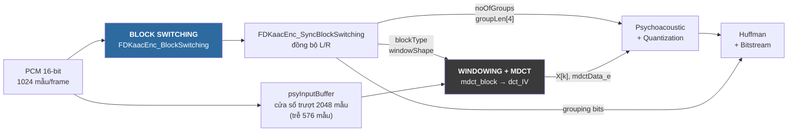
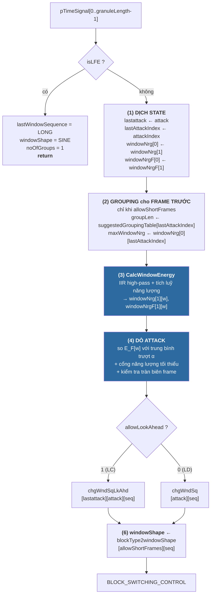
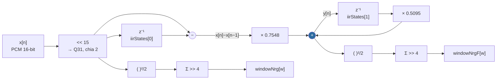
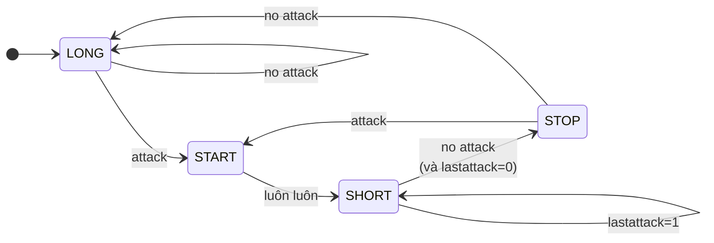
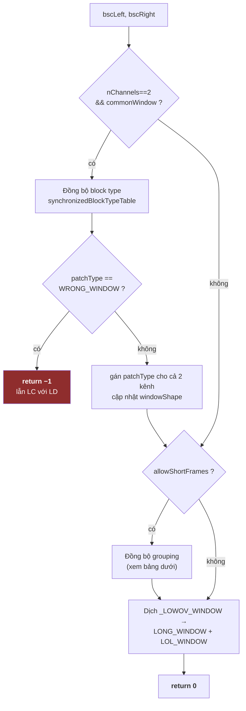

my_workspace# Khối Block Switching trong FDK-AAC — Input, Output, Thuật toán

Tài liệu mô tả khối phát hiện transient và quyết định loại cửa sổ của bộ **mã hoá**
AAC-LC trong FDK-AAC.

> Phạm vi: **encoder**, AAC-LC (`granuleLength = 1024`, 8 sub-window) và AAC-LD
> (`512`, 4 sub-window). `INT_PCM = SHORT` (16-bit).

---

## 0. Các file liên quan

| File | Vai trò |
|---|---|
| [libAACenc/src/block_switch.cpp](../../../libAACenc/src/block_switch.cpp) | Toàn bộ thuật toán |
| [libAACenc/src/block_switch.h](../../../libAACenc/src/block_switch.h) | `BLOCK_SWITCHING_CONTROL`, hằng số |
| [libAACenc/src/psy_const.h](../../../libAACenc/src/psy_const.h) | Enum block type / window shape, `TRANS_FAC`, `NORM_PCM` |
| [libAACenc/src/psy_main.cpp](../../../libAACenc/src/psy_main.cpp) | Nơi gọi khối — `FDKaacEnc_psyMain()` |

---

## 1. Vị trí trong pipeline

Đúng, PCM đi qua block switching **trước tiên** — nó là khối đầu tiên chạm vào
mẫu âm thanh, và quyết định của nó điều khiển mọi khối phía sau.



Khối này **chỉ phân tích, không sửa tín hiệu**. `pTimeSignal` được đọc, không ghi.

**Vì sao phải chạy trước:** AAC bắt buộc chèn `START_WINDOW` **trước** chuỗi
`SHORT_WINDOW`. Muốn vậy bộ mã hoá phải biết transient sắp tới **trước khi** MDCT
xử lý đoạn audio đó — nên block switching phân tích frame mới, còn MDCT xử lý dữ
liệu cũ hơn 576 mẫu. Xem [mdct_workflow.md](../../window_mdct/docs/mdct_workflow.md) mục 9.

### Vì sao cần chuyển cửa sổ?

| Loại block | Độ dài MDCT | Ưu | Nhược |
|---|---|---|---|
| Long | 1024 vạch | phân giải tần số cao, nén tốt | **pre-echo** khi có transient |
| Short | 8 × 128 vạch | phân giải thời gian cao | tốn bit hơn |

Pre-echo: lượng tử hoá nhiễu trải đều trên $2048$ mẫu $\approx 42.6$ ms ở 48 kHz.
Nếu transient nằm cuối block, nhiễu xuất hiện **trước** cú đánh — tai người nghe rõ
vì hiệu ứng che (masking) theo thời gian rất yếu ở phía trước.

---

## 2. Giao diện

```c
void FDKaacEnc_InitBlockSwitching(BLOCK_SWITCHING_CONTROL *bsc, INT isLowDelay);

int  FDKaacEnc_BlockSwitching(BLOCK_SWITCHING_CONTROL *bsc,
                              const INT      granuleLength,
                              const int      isLFE,
                              const INT_PCM *pTimeSignal);

int  FDKaacEnc_SyncBlockSwitching(BLOCK_SWITCHING_CONTROL *bscLeft,
                                  BLOCK_SWITCHING_CONTROL *bscRight,
                                  const INT nChannels,
                                  const INT commonWindow);
```

### 2.1 INPUT

| Tham số | Kiểu | Ý nghĩa |
|---|---|---|
| `pTimeSignal` | `const INT_PCM*` | **Dữ liệu duy nhất mang tín hiệu.** Một frame **mono**, `granuleLength` mẫu liên tiếp, đã de-interleave. Mỗi kênh gọi riêng. |
| `granuleLength` | `INT` | 1024 (AAC-LC) hoặc 512/480 (AAC-LD) |
| `isLFE` | `int` | 1 → bỏ qua toàn bộ phân tích, ép LONG/SINE |
| `bsc` | `BLOCK_SWITCHING_CONTROL*` | **Vừa input vừa output** — mang state xuyên frame |
| `isLowDelay` | `INT` | 0 = LC (8 sub-window, có SHORT, có look-ahead)<br/>1 = LD (4 sub-window, không SHORT, không look-ahead) |

> Khối **không** nhận sample rate, bitrate hay tham số cấu hình nào khác. Ngưỡng
> phát hiện là **tỉ lệ năng lượng** nên độc lập với $f_s$.

### 2.2 OUTPUT — `BLOCK_SWITCHING_CONTROL`

Hàm luôn `return 0`; chỉ `SyncBlockSwitching` trả `-1` khi lẫn cấu hình LC với LD.

| Field | Vai trò | Ai dùng |
|---|---|---|
| **`lastWindowSequence`** | ⭐ `LONG`(0) / `START`(1) / `SHORT`(2) / `STOP`(3) / `_LOWOV`(4, nội bộ) | MDCT, bitstream |
| **`windowShape`** | ⭐ `SINE`(0) / `KBD`(1) / `LOL`(2) | MDCT, bitstream |
| **`noOfGroups`**, **`groupLen[4]`** | ⭐ Gom 8 short block thành $\le 4$ nhóm, $\sum = 8$ | psy, quantizer, `grouping bits` |
| `attack`, `attackIndex` | Có transient không, ở sub-window nào | nội bộ |
| `lastattack`, `lastAttackIndex` | Giá trị frame trước | nội bộ (FSM, grouping) |
| `windowNrg[2][8]` | $E_w$ — năng lượng thô. `[0]`=frame trước, `[1]`=frame này | nội bộ |
| `windowNrgF[2][8]` | $E^F_w$ — năng lượng **sau lọc HP**, cái dùng để dò attack | nội bộ |
| `accWindowNrg` | $\alpha$ — trung bình trượt của $E^F$ | nội bộ |
| `maxWindowNrg` | Năng lượng tại sub-window attack của frame trước | `SyncBlockSwitching` |
| `iirStates[2]` | Delay-line bộ lọc — **state xuyên frame** | nội bộ |
| `nBlockSwitchWindows` | $W$ = 8 (LC) hoặc 4 (LD) | nội bộ |
| `lastWindowShape` | **Không do khối này ghi** — `FDKaacEnc_Transform_Real()` cập nhật | MDCT |

---

## 3. Sơ đồ khối thuật toán



---

## 4. Bước (3) — Tính năng lượng

### 4.1 Chia sub-window

$$W = \texttt{nBlockSwitchWindows} = \begin{cases} 8 & \text{AAC-LC} \\ 4 & \text{AAC-LD} \end{cases}
\qquad
L_w = \frac{\texttt{granuleLength}}{W} = 128$$

Cả hai chế độ đều cho $L_w = 128$ mẫu.

### 4.2 Bộ lọc IIR high-pass bậc 1

Datapath:



Hệ số `hiPassCoeff = {-0.5095, 0.7548}`. Code dùng `fMultDiv2` (= $\tfrac{1}{2}ab$) rồi
dịch trái 1, nên phương trình sai phân là:

$$y[n] \;=\; c_1\bigl(x[n]-x[n-1]\bigr) \;-\; c_0\,y[n-1], \qquad c_0=-0.5095,\; c_1=0.7548$$

$$\boxed{\,y[n] \;=\; 0.7548\,\bigl(x[n]-x[n-1]\bigr) \;+\; 0.5095\,y[n-1]\,}$$

Hàm truyền:

$$H(z) \;=\; \frac{0.7548\,\bigl(1-z^{-1}\bigr)}{1-0.5095\,z^{-1}}$$

Zero tại $z=1$ (triệt DC), cực tại $z=0.5095$. Độ lợi tại Nyquist $\approx 1$.
Điểm cắt $-3$ dB: giải $|H(\omega)|^2 = \tfrac12$ cho

$$\cos\omega_c = 0.8090 \;\Rightarrow\; \omega_c = 0.2\pi \;\Rightarrow\;
\boxed{\,f_c \approx 0.1\,f_s\,}$$

tức **4.8 kHz ở 48 kHz**. Hệ số cố định nên điểm cắt luôn tỉ lệ với $f_s$.

**Mục đích:** transient (trống, castanet) giàu năng lượng tần số cao; high-pass làm
attack nổi bật so với tín hiệu tonal ổn định, giảm báo động giả trên nhạc cụ trầm.

> `iirStates[0..1]` **không reset giữa các frame**. Reset chúng = sai ở biên frame.

### 4.3 Scaling fixed-point

```c
tempUnfiltered  = x << (DFRACT_BITS - SAMPLE_BITS - 1);          // x << 15
temp_windowNrg += (LONG)fPow2Div2(v) >> (BLOCK_SWITCH_ENERGY_SHIFT - 1 - 2);  // >> 4
```

Đặt $\bar{x}[n] = x[n]/2^{15} \in [-1,1)$ là mẫu chuẩn hoá. Khi đó giá trị Q31 sau
dịch là $\hat{x} = \bar{x}/2$, và với $\texttt{fPow2Div2}(v)=v^2/2$:

$$\frac{1}{2^{4}}\cdot\frac{\hat{x}^2}{2}
= \frac{1}{2^{4}}\cdot\frac{1}{2}\left(\frac{\bar{x}}{2}\right)^{2}
= \frac{\bar{x}^{2}}{2^{7}}$$

$$\boxed{\;E_w \;=\; \frac{1}{2^{7}}\sum_{n=0}^{L_w-1}\bar{x}[n]^{2}
\;=\; \frac{1}{L_w}\sum_{n=0}^{L_w-1}\bar{x}[n]^{2}\;}$$

vì $\texttt{BLOCK\_SWITCH\_ENERGY\_SHIFT} = 7 = \log_2 L_w$.

> **$E_w$ chính là trung bình bình phương (RMS²) của sub-window, chuẩn hoá theo
> full-scale.** Đây là cách hiểu gọn nhất và cũng giải thích vì sao hằng số shift
> phải bằng $\log_2 L_w$: với $|\bar{x}|\le 1$ thì $E_w \le 1$, vừa đúng
> tràn đầy Q31 mà không tràn.

Cuối cùng bão hoà: `fMin(temp, MAXVAL_DBL)`.

*Kiểm chứng:* sine biên độ $0.5$ → $E_w = 0.5^2/2 = 0.125$ → Q31 $= 268\,435\,456$.
Harness in ra $259\,965\,782$ ✔️ (sai lệch do truncation và số chu kỳ không nguyên).

$E^F_w$ tính y hệt nhưng trên $y[n]$ thay vì $\hat{x}[n]$.

---

## 5. Bước (4) — Dò attack

### 5.1 Trung bình trượt

`fMultAdd(x,a,b)` $= 2x + ab$, nên hai dòng code

```c
tmp = fMultDiv2(oneMinusAccWindowNrgFac, acc);   // 0.35·α
acc = fMultAdd(tmp, accWindowNrgFac, enM1);      // 2·(0.35α) + 0.3·E
```

tương đương bộ lọc trung bình trượt mũ (EMA) bậc 1:

$$\boxed{\;\alpha_w \;=\; (1-\lambda)\,\alpha_{w-1} \;+\; \lambda\, E^F_{w-1}\;},
\qquad \lambda = 0.3$$

Hằng số thời gian $\approx 1/\lambda \approx 3.3$ sub-window $\approx 8.8$ ms ở 48 kHz.

Hai chi tiết quan trọng:

* $\alpha$ cập nhật **trước** phép so sánh, và dùng $E^F_{w-1}$ (sub-window **trước**)
  — nên sub-window đang xét **không** tự làm loãng ngưỡng của chính nó.
* Với $w=0$, $E^F_{w-1}$ lấy từ `windowNrgF[0][W-1]` → nối liền qua biên frame.

### 5.2 Điều kiện attack

$$\rho^{-1} E^F_w > \alpha_w
\quad\Longleftrightarrow\quad
\boxed{\;E^F_w > \rho\,\alpha_w\;},\qquad \rho = 10$$

(`invAttackRatio` $=\rho^{-1}=0.1$.) Nghĩa là: **năng lượng sub-window vượt 10 lần
mức nền trượt**.

Vòng lặp **không `break`** → `attackIndex` là sub-window attack **cuối cùng** trong frame.

### 5.3 Cổng năng lượng tối thiểu

$$E_{\max} = \max_{w} E^F_w, \qquad
E_{\max} < \Theta \;\Rightarrow\; \texttt{attack} = \text{FALSE}$$

$$\Theta = \frac{10^{6}\cdot \texttt{NORM\_PCM\_ENERGY}}{2^{7}}
= \frac{10^{6}}{2^{30}\cdot 2^{7}} = \frac{10^{6}}{2^{37}} \approx 7.28\times10^{-6}$$

Dạng số nguyên Q31: $\Theta_{\text{int}} = 15\,625$.

Vì $E_w$ là RMS², ngưỡng này tương đương

$$\text{RMS} = \sqrt{\Theta} \approx 2.70\times 10^{-3}
\;\Rightarrow\; \boxed{\approx -51.4\ \text{dBFS}}$$

Ngăn "attack" giả trong đoạn gần im lặng.

### 5.4 Attack tràn qua biên frame

Khi frame này *không* attack nhưng frame trước *có*:

$$\left(E^{F,\text{prev}}_{W-1} \gg 4\right) > 0.625\cdot E^{F,\text{cur}}_{1}
\quad\Longleftrightarrow\quad
E^{F,\text{prev}}_{W-1} > 10\,E^{F,\text{cur}}_{1}$$

(hằng số `10 << (DFRACT_BITS-1-4)` $= 0.625$ trong Q31.)

Nếu đồng thời `lastAttackIndex == W-1` thì đặt `attack = TRUE`, `attackIndex = 0`
→ **kéo dài chuỗi SHORT thêm một frame**.

---

## 6. Bước (5) — Máy trạng thái cửa sổ

### 6.1 AAC-LC (`allowLookAhead = 1`)

`chgWndSqLkAhd[lastattack][attack][lastWindowSequence]`:

| `lastattack` | `attack` | LONG | START | SHORT | STOP |
|---|---|---|---|---|---|
| 0 | 0 | LONG | SHORT | STOP | LONG |
| 0 | 1 | START | SHORT | SHORT | START |
| 1 | 0 | LONG | SHORT | SHORT | LONG |
| 1 | 1 | START | SHORT | SHORT | START |



Chuỗi điển hình quanh một transient:

$$\texttt{LONG} \to \texttt{START} \to \texttt{SHORT} \to \texttt{STOP} \to \texttt{LONG}$$

`START` luôn chuyển sang `SHORT` bất kể attack — đó là ràng buộc của chuẩn AAC.

### 6.2 AAC-LD (`allowLookAhead = 0`)

`chgWndSq[attack][lastWindowSequence]`:

| `attack` | LONG | START | STOP | LOWOV |
|---|---|---|---|---|
| 0 | LONG | STOP | LONG | STOP |
| 1 | START | LOWOV | START | LOWOV |

Không có `SHORT`. AAC-LD chống pre-echo bằng cách đổi **hình dạng cửa sổ**
(overlap ngắn — Low OverLap) thay vì đổi độ dài block.

### 6.3 Bước (6) — Window shape

`blockType2windowShape[allowShortFrames][lastWindowSequence]`:

| `allowShortFrames` | LONG | START | SHORT | STOP | LOWOV |
|---|---|---|---|---|---|
| 0 (LD) | SINE | KBD | — | SINE | KBD |
| 1 (LC) | KBD | SINE | SINE | KBD | — |

---

## 7. Grouping

`suggestedGroupingTable[attackIndex][4]` — gom 8 short block thành $\le 4$ nhóm,
đặt ranh giới nhóm sát vị trí attack, $\sum_i \texttt{groupLen}[i] = 8$:

| `attackIndex` | `groupLen` | | `attackIndex` | `groupLen` |
|---|---|---|---|---|
| 0 | 1,3,3,1 | | 4 | 3,1,1,3 |
| 1 | 1,1,3,3 | | 5 | 3,2,1,2 |
| 2 | 2,1,3,2 | | 6 | 3,3,1,1 |
| 3 | 3,1,3,1 | | 7 | 3,3,1,1 |

> **Grouping mô tả FRAME TRƯỚC**, không phải frame vừa nạp — nó tính ở bước (2)
> bằng `lastAttackIndex`. Cùng lý do với look-ahead.

---

## 8. `FDKaacEnc_SyncBlockSwitching()`

Chạy **sau** khi đã gọi `FDKaacEnc_BlockSwitching()` cho từng kênh.



Quy tắc đồng bộ grouping:

| Tình huống | Kết quả |
|---|---|
| `patchType != SHORT` | `noOfGroups = 1`, `groupLen = {1,0,0,0}` |
| Cả hai kênh đều SHORT trước sync | Dùng grouping của kênh có `maxWindowNrg` lớn hơn |
| Chỉ một kênh SHORT | Kênh kia copy theo |
| Ép SHORT từ START/STOP | `groupLen = {4,4,0,0}` |

> Nhánh grouping chỉ chạy khi `allowShortFrames = 1`. Ở AAC-LD, `groupLen` giữ
> nguyên `{0,0,0,0}`.

`_LOWOV_WINDOW` chỉ tồn tại trong `block_switch.cpp`; ra khỏi khối nó được dịch
thành cặp hợp lệ `(LONG_WINDOW, LOL_WINDOW)`.

---

## 9. Kết quả thực nghiệm

Từ harness [test_block_switch.cpp](../tb/test_block_switch.cpp) — xem [README.md](../README.md).

### 9.1 Transient đơn lẻ (AAC-LC) — chuỗi kinh điển

Nền sine 400 Hz nhỏ + một cú đánh tại mẫu 3584 (giữa frame 3, sub-window 4):

```
 fr | atk idx | seq   shape | grp groupLen
  2 |  0   0  | LONG  KBD  |  4  1,3,3,1
  3 |  1   4  | START SINE |  4  1,3,3,1     ← phát hiện attack ở sub-window 4
  4 |  0   4  | SHORT SINE |  4  3,1,1,3     ← grouping của frame 3
  5 |  0   4  | STOP  KBD  |  4  3,1,1,3
  6 |  0   4  | LONG  KBD  |  4  3,1,1,3
```

Năng lượng frame 3 — bậc nhảy $\approx 50$ dB tại sub-window 4:

| $w$ | `windowNrg` | `windowNrgF` | dB |
|---|---|---|---|
| 0 | 430 830 | 2 736 | −58.9 |
| 1 | 449 746 | 2 606 | −59.2 |
| 2 | 455 207 | 2 550 | −59.3 |
| 3 | 443 689 | 2 605 | −59.2 |
| **4** | **393 585 762** | **349 904 830** | **−7.9** ← ATTACK |
| 5 | 165 696 977 | 148 957 730 | −11.6 |
| 6 | 70 908 405 | 63 073 440 | −15.3 |
| 7 | 30 799 072 | 27 153 140 | −19.0 |

$\texttt{attackIndex}=4 \Rightarrow \texttt{groupLen}=\{3,1,1,3\}$ ✔️

### 9.2 Attack giả khi khởi động lạnh

Sine ổn định vẫn cho attack ở **frame 0**:

```
  0 |  1   0  | START SINE     ← α = 0 sau Init → mọi E_F đều > 10·α
  1 |  0   0  | SHORT SINE
  2 |  0   0  | STOP  KBD
  3 |  0   0  | LONG  KBD      ← ổn định từ đây
```

Đây là hành vi cố hữu: $\alpha_{-1}=0$ sau `Init`, nên sub-window đầu tiên vượt
$\Theta$ luôn thoả $E^F > 10\alpha$. Cần nhớ khi so sánh bitstream ở frame đầu.

### 9.3 Các trường hợp khác

* `silence`: $E_{\max}=0 < \Theta$ → luôn LONG, $\alpha$ giữ 0.
* `slow_crescendo`: biên độ tăng tuyến tính, tỉ lệ hai sub-window liền kề luôn
  $\ll 10$ → không attack (trừ frame 0).
* `castanets` (transient mỗi 700 mẫu): attack **rải rác** (frame 0, 6, 7…) chứ không
  liên tục — chính các cú đánh dồn dập kéo $\alpha$ lên cao ($\approx 2$–$5\times10^7$)
  nên cú sau không đạt tỉ lệ 10×. Cơ chế thích nghi có chủ đích, tránh ép SHORT vô
  hạn trên nhạc percussive dày.
* `isLFE = 1`: luôn LONG/SINE, `noOfGroups = 1` bất kể tín hiệu.

---

## 10. Ghi chú cho thiết kế RTL

### 10.1 Ánh xạ fixed-point

`fixmuldiv2_DD(a,b) = ((int64)a*b) >> 32`. Tất cả đều **truncation**, không làm tròn.

| C | VHDL |
|---|---|
| `fMultDiv2(a,b)` | `p := signed(a)*signed(b); r := p(63 downto 32)` |
| `fMult(a,b)` | `p(62 downto 31)` |
| `fMultAdd(x,a,b)` | `2x + p(62 downto 31)` |
| `fPow2Div2(a)` | bình phương → `p(63 downto 32)` |
| `x << 15` | nối `x & "000000000000000"` |

### 10.2 Tài nguyên

**4 phép nhân có dấu mỗi mẫu** (2 cho IIR, 2 cho bình phương). Ở 48 kHz stereo:
$96\,000 \times 4 = 384$ k nhân/giây. Ở 50 MHz bạn có $\approx 130$ chu kỳ ngân sách
mỗi mẫu → **một DSP block time-share là thừa**. Build với `SINETABLE_16BIT` thì hai
nhân IIR thành $32\times16$, còn rẻ hơn.

**Bộ nhớ:** `windowNrg[2][8] + windowNrgF[2][8]` $= 32 \times 32$ bit $= 128$ byte.
Registers, không cần BRAM.

**Toàn bộ phần "thông minh" là ROM tổ hợp:** `chgWndSqLkAhd`, `blockType2windowShape`,
`suggestedGroupingTable`, `synchronizedBlockTypeTable` — cộng lại $\approx 100$ entry,
mỗi entry $\le 3$ bit.

### 10.3 Ba cái dễ sai

1. **Bộ tích luỹ phải `unsigned` 32-bit rồi mới bão hoà.** Đường unfiltered với DC
   full-scale cho $128 \times 16\,775\,000 \approx 2.147\times10^9$ — sát nóc $2^{31}$.
   Đường filtered thì **vượt** hẳn (HP filter có độ lợi $>1$ với tín hiệu đổi dấu).
   Dùng `signed(31 downto 0)` là tràn âm. C dùng `ULONG` rồi `fMin(temp, MAXVAL_DBL)`.
2. **`iirStates` sống xuyên frame**, không reset giữa các frame.
3. **`α` cập nhật trước phép so sánh**, và $E^F_{w-1}$ của $w=0$ lấy từ frame trước.
   Vòng lặp không `break`.

### 10.4 Kiến trúc

Streaming per-sample cho phần năng lượng, rồi một "đuôi" $W=8$ chu kỳ cuối frame để
dò attack + tra bảng. Độ trễ 1 frame là **cố hữu** — chính nó tạo ra look-ahead mà AAC cần.

Không có block-floating-point, không có vòng lặp phụ thuộc dữ liệu → **khối này
bit-exact được** với FDK-AAC.

---

## 11. Tóm tắt một dòng

> **Vào:** 1 frame PCM 16-bit mono ($\texttt{granuleLength}$ mẫu) + state frame trước.
> **Ra:** `lastWindowSequence`, `windowShape`, `noOfGroups`/`groupLen[]`.
> **Thuật toán:** lọc high-pass IIR bậc 1 ($f_c \approx 0.1 f_s$) → năng lượng
> $E^F_w = \frac{1}{L_w}\sum \bar{y}^2$ trên $W$ sub-window → attack khi
> $E^F_w > 10\,\alpha_w$ với $\alpha$ là EMA hệ số $0.3$, và $\max_w E^F_w \ge -51.4$ dBFS
> → tra bảng máy trạng thái.
