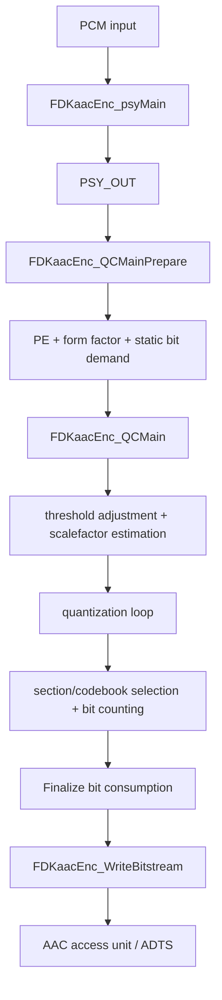

# Psychoacoustic Model AAC-LC trong FDK-AAC

## 1. Mục đích

Thư mục này mô tả giai đoạn xử lý sau Window/MDCT của bộ mã hóa AAC-LC:

```text
MDCT spectrum
  -> Psychoacoustic Model
  -> điều chỉnh threshold và phân bổ bit
  -> quantization
  -> sectioning/Huffman coding
  -> AAC bitstream
```

Tài liệu bám theo source FDK-AAC hiện tại, đặc biệt là:

- `libAACenc/src/aacenc.cpp`;
- `libAACenc/src/psy_main.cpp`;
- `libAACenc/src/psy_configuration.cpp`;
- `libAACenc/src/interface.h`;
- `libAACenc/src/qc_main.cpp`;
- `libAACenc/src/adj_thr.cpp`;
- `libAACenc/src/quantize.cpp`;
- `libAACenc/src/dyn_bits.cpp`;
- `libAACenc/src/bit_cnt.cpp`;
- `libAACenc/src/bitenc.cpp`.

Phạm vi chính là AAC-LC, frame 1024 mẫu và cấu hình mono đầu tiên của dự án PYNQ-Z2. TNS, PNS và stereo vẫn được trình bày vì chúng nằm trong luồng thực của `FDKaacEnc_psyMain()` và sẽ cần khi mở rộng hệ thống.

## 2. Kết luận kiến trúc quan trọng

Trong FDK-AAC, MDCT không nằm ngoài Psychoacoustic Model theo nghĩa tổ chức hàm. Hàm:

```text
FDKaacEnc_psyMain()
```

thực hiện theo thứ tự:

```text
Block Switching
  -> FDKaacEnc_Transform_Real()
  -> xử lý spectrum và tính năng lượng SFB
  -> TNS
  -> masking threshold và pre-echo control
  -> PNS/MS/Intensity Stereo
  -> tạo PSY_OUT
```

Do đó khi đưa MDCT sang PL, không thay toàn bộ `FDKaacEnc_psyMain()`. Chỉ thay điểm gọi:

```text
FDKaacEnc_Transform_Real()
```

bằng backend MDCT phần cứng trả về:

```text
mdctSpectrum[1024] + mdctSpectrum_e
```

Sau đó toàn bộ Psy, quantization và coding tiếp tục chạy nguyên bản trên Cortex-A9.

## 3. Vai trò của Psychoacoustic Model

MDCT chỉ cho biết năng lượng tín hiệu nằm ở đâu trong miền tần số. Nó chưa quyết định:

- sai số lượng tử nào có thể chấp nhận được;
- band nào quan trọng hơn;
- band nào bị âm thanh lân cận che lấp;
- transient có nguy cơ gây pre-echo hay không;
- có nên dùng TNS/PNS/MS/Intensity Stereo hay không;
- cần phân bổ bao nhiêu bit cho từng band.

Psychoacoustic Model biến phổ MDCT thành tập ràng buộc cảm nhận, chủ yếu theo từng **scalefactor band — SFB**:

```text
Spectrum X[k]
  -> năng lượng E[sfb]
  -> masking threshold T[sfb]
  -> min-SNR/tool decisions
  -> dữ liệu PSY_OUT cho Quantization & Coding
```

Nguyên tắc trực giác:

```text
nhiễu lượng tử <= masking threshold
```

thì nhiễu có khả năng bị tín hiệu âm thanh che lấp và ít nghe thấy hơn. Quantizer dùng threshold như mục tiêu chất lượng, đồng thời phải thỏa ngân sách bit của frame.

## 4. Luồng top-level của một frame

Trong `FDKaacEnc_EncodeFrame()`:



Thứ tự lời gọi chính trong source:

1. `FDKaacEnc_psyMain()`;
2. `FDKaacEnc_QCMainPrepare()`;
3. `FDKaacEnc_AdjustBitrate()`;
4. `FDKaacEnc_QCMain()`;
5. `FDKaacEnc_updateFillBits()`;
6. `FDKaacEnc_FinalizeBitConsumption()`;
7. `FDKaacEnc_updateBitres()`;
8. `FDKaacEnc_WriteBitstream()`.

## 5. Tài liệu trong thư mục

- [psy_model_pipeline.md](docs/psy_model_pipeline.md): giải thích chi tiết từng giai đoạn của Psychoacoustic Model.
- [psy_qc_interface.md](docs/psy_qc_interface.md): hợp đồng dữ liệu MDCT → Psy → Quantization/Coding và điểm tích hợp PL.
- [verification_plan.md](docs/verification_plan.md): kế hoạch tạo trace/golden và kiểm chứng Psy trên PC, ARM và PYNQ-Z2.

## 6. Ranh giới HW/SW của dự án PYNQ-Z2

| Khối | Vị trí phiên bản đầu | Ghi chú |
|---|---|---|
| Block Switching | PS | Giữ state/control FDK |
| Window/MDCT | PL | Accelerator hiện tại |
| Low-pass spectrum | PS | Phần đầu sau transform trong `psy_main.cpp` |
| SFB energy/threshold | PS | Nhiều bảng cấu hình và fixed-point scale |
| Tonality/TNS/PNS | PS | Giữ nguyên FDK |
| MS/Intensity Stereo | PS | Chỉ dùng khi stereo |
| PE/threshold adjustment | PS | Gắn chặt với rate control/bit reservoir |
| Quantization | PS | Vòng lặp phụ thuộc bit count |
| Huffman/bitstream | PS | Logic control và bit-level syntax |

Không nên đưa Psy lên PL ngay trong giai đoạn đầu. So với MDCT, Psy có nhiều state, bảng cấu hình, nhánh theo bitrate/sample rate/block type và vòng phản hồi với quantizer. Giữ Psy trên PS giúp giới hạn giao diện accelerator ở cặp dữ liệu rõ ràng:

```text
(mdctSpectrum[1024], mdctSpectrum_e)
```

## 7. Thuật ngữ ngắn

| Thuật ngữ | Ý nghĩa |
|---|---|
| MDCT line/bin | Một hệ số phổ MDCT |
| SFB | Scalefactor band, nhóm các MDCT line gần nhau |
| Energy | Tổng năng lượng các line trong một SFB |
| Masking threshold | Mức nhiễu lượng tử tối đa mục tiêu cho band |
| Spreading | Ảnh hưởng masking lan sang band lân cận |
| Pre-echo | Nhiễu lượng tử xuất hiện trước transient và có thể nghe thấy |
| Tonality | Mức giống tonal/noise của một band |
| TNS | Temporal Noise Shaping, định hình nhiễu lượng tử theo thời gian |
| PNS | Perceptual Noise Substitution, thay band giống nhiễu bằng tham số năng lượng |
| PE | Perceptual Entropy, ước lượng độ khó/số bit cảm nhận cần thiết |
| Scalefactor | Điều chỉnh bước lượng tử theo từng SFB |
| Global gain | Mức lượng tử chung của channel/frame |
| Bit reservoir | Bit tích lũy/điều hòa giữa các frame trong CBR |

