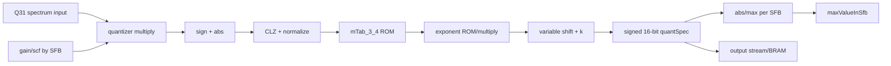

# Giao diện và kiểm chứng accelerator Quantization/Coding

## 1. Mục tiêu phiên bản RTL đầu

Accelerator đầu tiên chỉ thực hiện:

```text
QMAX = QuantizeSpectrum + calcMaxValueInSfb
```

Không thực hiện:

- PE/threshold adjustment;
- scalefactor search;
- QC loop;
- section merging;
- bit reservoir;
- Huffman emission;
- bitstream writer.

Mục tiêu là tạo một kernel có input/output và oracle rõ, dễ đạt bit-exact trước khi mở rộng.

## 2. Hợp đồng input

### Dữ liệu frame/channel

| Trường | Kiểu | Ý nghĩa |
|---|---:|---|
| `frame_id` | uint32 | Đồng bộ transaction |
| `channel_id` | uint8 | Mono = 0; dùng khi mở rộng stereo |
| `spectrum` | `1024 × int32` | Spectrum sau Psy/TNS/MS, FIXP_DBL/Q31 |
| `sfbCnt` | uint8 | Tổng SFB/grouped SFB |
| `sfbPerGroup` | uint8 | SFB mỗi group |
| `maxSfbPerGroup` | uint8 | Số band active trong mỗi group |
| `sfbOffsets` | tối đa 61 × uint16 | Ranh giới spectral line |
| `globalGain` | int16/int32 | Global gain FDK |
| `scf` | tối đa 60 × int16/int32 | Scalefactor theo grouped SFB |
| `dZoneQuantEnable` | 1 bit | Chọn offset dead-zone |

Không hard-code SFB layout 48 kHz. `sfbOffsets` phải là runtime input để hỗ trợ long/short và các sample rate sau này.

## 3. Hợp đồng output

| Trường | Kiểu | Ý nghĩa |
|---|---:|---|
| `quantSpec` | `1024 × int16` | Kết quả lượng tử hóa |
| `maxValueInSfb` | tối đa 60 × uint16/uint32 | Max absolute value mỗi band |
| `maxQuant` | uint32 | Maximum toàn channel |
| `violation` | 1 bit | `maxQuant > MAX_QUANT` |
| `cycleCount` | uint32 | Latency accelerator |
| `errorFlags` | uint32 | Protocol/config error |
| `frame_id_out` | uint32 | Phải bằng input |

## 4. Register map đề xuất

| Offset | Tên | R/W | Nội dung |
|---:|---|---|---|
| `0x00` | `IP_ID` | R | Magic QMAX |
| `0x04` | `IP_VERSION` | R | Version contract/LUT |
| `0x08` | `CONTROL` | R/W | reset, abort, irq enable |
| `0x0C` | `STATUS` | R | ready, loading, running, outputting, done, error |
| `0x10` | `FRAME_ID_IN` | R/W | Frame tag |
| `0x14` | `CONFIG0` | R/W | channel, dead-zone, sfbCnt |
| `0x18` | `CONFIG1` | R/W | sfbPerGroup, maxSfbPerGroup |
| `0x1C` | `GLOBAL_GAIN` | R/W | Global gain |
| `0x20` | `FRAME_ID_OUT` | R | Completed tag |
| `0x24` | `MAX_QUANT` | R | Maximum quantized magnitude |
| `0x28` | `ERROR_FLAGS` | R/W1C | Protocol/config errors |
| `0x2C` | `CYCLE_COUNT` | R | Measured cycles |

SFB offset/scalefactor arrays không nên map thành hàng trăm AXI-Lite register trong production. Có thể đóng thành metadata stream/header hoặc dùng BRAM window nhỏ có addressable AXI slave. Phiên bản test ban đầu có thể dùng register/BRAM window để dễ debug.

## 5. Data movement

### Phương án đơn giản để nghiệm thu

```text
PS DDR spectrum
  -> AXI DMA MM2S
  -> QMAX input buffer/engine
  -> quantSpec stream
  -> AXI DMA S2MM
  -> PS DDR
```

`maxValueInSfb` có thể đọc qua AXI-Lite/BRAM window vì mảng nhỏ.

### Phương án tối ưu nhiều iteration

```text
LOAD_SPECTRUM một lần
  -> giữ 1024 Q31 trong BRAM

RUN_QUANT(candidate gain/scf)
  -> trả max/violation/bit-cost
  -> không DMA lại spectrum

FINALIZE
  -> DMA quantSpec cuối về PS
```

Phương án persistent giảm chi phí DMA khi QC thử nhiều gain, nhưng state machine và coherency phức tạp hơn. Chỉ phát triển sau khi phiên bản stateless khớp 0 LSB.

## 6. Datapath RTL đề xuất



Controller theo dõi:

- spectral line index;
- group/SFB index;
- next `sfbOffset`;
- current `gain = globalGain - scf`;
- active/inactive bands;
- output count và TLAST.

Các band ngoài `maxSfbPerGroup` phải giữ behavior giống FDK/caller, không tự suy diễn từ nội dung spectrum.

## 7. ROM và profile

RTL phải lấy literal từ cùng source FDK:

- `FDKaacEnc_quantTableQ`;
- `FDKaacEnc_quantTableE`;
- `FDKaacEnc_mTab_3_4`;
- các constant liên quan `MANT_DIGITS`, `MANT_SIZE`, fractional widths;
- dead-zone offsets.

Mỗi bộ ROM/contract phải có:

- profile ID;
- source revision;
- SHA-256 của literal serialization;
- generator script;
- golden vectors.

Không sinh ROM độc lập từ công thức float rồi làm tròn lại, vì có thể lệch LSB so với FDK.

## 8. Arithmetic contract cần khóa

Cho từng spectral line phải khóa:

1. kiểu và width của `FIXP_DBL`, `FIXP_QTD`, `LONG`, `SHORT`;
2. hành vi `fMultDiv2`;
3. cách xử lý `INT32_MIN`/dấu;
4. `CntLeadingZeros` với input khác 0;
5. index ROM từ mantissa normalized;
6. gain modulo/shift với số âm;
7. thứ tự multiply/shift;
8. offset `k` theo dead-zone mode;
9. arithmetic/logical shift;
10. cast/truncate sang 16 bit;
11. `MAX_QUANT` threshold;
12. behavior zero input.

Biểu thức toán học `|X|^(3/4)` chỉ dùng để giải thích, không phải đặc tả RTL.

## 9. Kế hoạch golden/reference

### Reference bắt buộc

Tách một harness C++ gọi trực tiếp:

```text
FDKaacEnc_QuantizeSpectrum()
FDKaacEnc_calcMaxValueInSfb() hoặc logic tương đương caller
```

Harness đọc:

- spectrum bit pattern;
- SFB layout;
- gains/scalefactors;
- dead-zone flag;

và ghi:

- quantSpec;
- maxValueInSfb;
- violation;
- intermediate trace tùy debug.

### Python integer model

Chỉ viết sau khi đã khóa arithmetic contract và literal ROM. Python phải mô phỏng đúng fixed width, không dùng NumPy float làm golden bit-exact.

### NumPy float

Có thể dùng để kiểm tra xu hướng/đồ thị lượng tử hóa, nhưng không dùng làm tiêu chí 0 LSB.

## 10. Test vector tối thiểu

| Nhóm | Nội dung |
|---|---|
| Zero | toàn spectrum 0 |
| Impulse line | một bin dương/âm ở mỗi ranh SFB |
| Boundary | giá trị gần 0, ±1 LSB, INT32 min/max hợp lệ |
| Gain sweep | mọi residue `gain mod 4`, shift nhỏ/lớn |
| Dead-zone | bật/tắt cùng input |
| MaxQuant | ngay dưới/bằng/trên `MAX_QUANT` |
| SFB width | band hẹp/rộng, mọi offset hợp lệ |
| Long | layout long AAC-LC |
| Short | grouped short layout |
| Real audio | silence, sine, noise, transient, music/speech |
| Iteration | cùng spectrum với chuỗi global gain tăng/giảm |

## 11. Các tầng kiểm chứng

1. C++ direct function ↔ golden dump.
2. Python integer ↔ C++: 0 LSB.
3. RTL simulation ↔ C++ golden: 0 LSB cho mọi line/max.
4. AXI wrapper simulation với backpressure/TLAST/config errors.
5. Board HIL QMAX độc lập.
6. FDK software quantizer ↔ PL quantizer trên Cortex-A9.
7. QC end-to-end: global gain, scf, quantSpec, section map, bit counts.
8. AAC bitstream/decode regression.

## 12. Checkpoint cần so khi tích hợp

| Checkpoint | Tiêu chí |
|---|---|
| Spectrum input PL | Bằng buffer FDK sau Psy |
| SFB metadata | Offset/count/group khớp |
| Gain/scf | Khớp iteration hiện tại |
| quantSpec | 1024/1024, 0 LSB |
| maxValueInSfb | Khớp mọi SFB |
| violation | Khớp `MAX_QUANT` decision |
| dynBitCount | Giống software sau khi dùng output PL |
| iteration count | Giống software baseline |
| final globalGain/scf | Giống software |
| section/codebook | Giống software |
| total frame bits | Giống software |

Nếu QMAX khớp nhưng số iteration/bitstream khác, lỗi thường nằm ở state/control QC, metadata SFB hoặc buffer bị thay đổi giữa các lần gọi, không phải datapath quantizer.

## 13. Tiêu chí triển khai trên XC7Z020

- synth/place/route PASS trên `xc7z020clg400-1`;
- WNS không âm tại clock mục tiêu;
- ROM/RAM được suy luận đúng;
- không làm MDCT + QMAX vượt LUT/FF/BRAM/DSP budget;
- debug build và production build tách riêng;
- board output khớp 0 LSB;
- tổng latency gồm DMA/cache thấp hơn software path;
- CPU load toàn encoder giảm đo được;
- không làm thay đổi AAC conformance.

## 14. Trình tự hành động khuyến nghị

1. Profile QC trên Cortex-A9.
2. Thêm timer/counter cho từng hàm, không sửa số học.
3. Nếu quantize/distortion là hotspot, viết C++ direct harness.
4. Khóa fixed-point/ROM contract.
5. Viết Python integer model và golden.
6. Viết QMAX RTL native interface.
7. Verify RTL 0 LSB.
8. Thêm AXI wrapper/DMA.
9. Board HIL độc lập.
10. Thêm backend abstraction vào QC.
11. So toàn bộ iteration và bitstream.
12. Chỉ sau đó cân nhắc QDIST hoặc codebook-cost accelerator.

