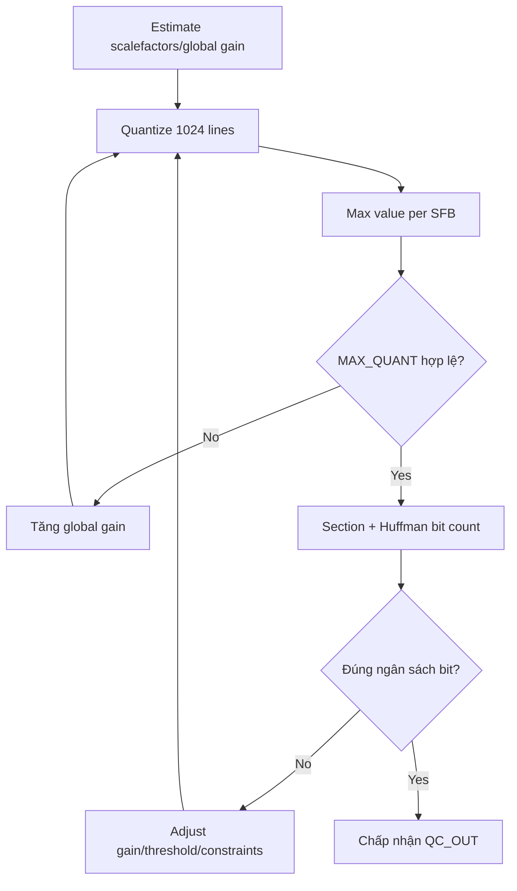

# Luồng Quantization and Coding trong FDK-AAC

## 1. Vị trí trong một frame AAC-LC

Trong [`FDKaacEnc_EncodeFrame()`](../../../libAACenc/src/aacenc.cpp), thứ tự liên quan là:

```text
FDKaacEnc_psyMain()
  -> FDKaacEnc_QCMainPrepare()
  -> FDKaacEnc_AdjustBitrate()
  -> FDKaacEnc_QCMain()
  -> FDKaacEnc_updateFillBits()
  -> FDKaacEnc_FinalizeBitConsumption()
  -> FDKaacEnc_updateBitres()
  -> FDKaacEnc_WriteBitstream()
```

`PSY_OUT_CHANNEL` và `QC_OUT_CHANNEL` chia sẻ các buffer lớn như `mdctSpectrum`, energy và threshold. QC nhận spectrum đã qua low-pass, TNS, PNS/MS/IS preparation và SFB grouping từ Psy.

## 2. Input của Quantization and Coding

Input quan trọng từ Psy cho mỗi channel:

| Dữ liệu | Vai trò |
|---|---|
| `mdctSpectrum[1024]` | Spectrum Q31 cần lượng tử hóa |
| `mdctScale` | Scale hiện tại sau Psy/TNS |
| `sfbOffsets[]` | Biên spectral line của mỗi SFB |
| `sfbCnt` | Tổng SFB sau grouping |
| `sfbPerGroup` | SFB mỗi window group |
| `maxSfbPerGroup` | SFB cao nhất cần mã hóa |
| `sfbEnergyLdData[]` | Năng lượng band ở miền log |
| `sfbThresholdLdData[]` | Distortion/masking target |
| `sfbMinSnrLdData[]` | Giới hạn chất lượng tối thiểu |
| `sfbSpreadEnergy[]` | Hỗ trợ tránh spectral hole |
| `noiseNrg[]` | PNS band metadata |
| `isBook[]`, `isScale[]` | Intensity Stereo metadata |
| `tnsInfo`, `msMask[]` | Side information phải mã hóa |

Input rate-control:

- bitrate/sample rate/frame length;
- static/extension/header bits;
- bit reservoir hiện tại;
- channel element mapping;
- CBR/VBR mode;
- maximum bits per frame;
- Afterburner/inverse-quantization mode.

## 3. Giai đoạn 1 — Form Factor và Perceptual Entropy

`FDKaacEnc_QCMainPrepare()` thực hiện ba việc:

1. `FDKaacEnc_CalcFormFactor()`;
2. `FDKaacEnc_peCalculation()`;
3. `FDKaacEnc_ChannelElementWrite()` ở chế độ chỉ đếm static bits.

### Form factor

Form factor phản ánh cách năng lượng phân bố giữa các spectral line trong một SFB. Hai band có cùng tổng năng lượng nhưng một band tập trung vào vài line và một band trải đều sẽ có độ khó lượng tử hóa khác nhau.

### Perceptual Entropy — PE

PE ước lượng lượng thông tin cần để giữ distortion dưới masking threshold:

```text
energy/threshold lớn
  -> band khó mã hóa
  -> PE lớn
  -> cần nhiều bit hơn
```

Trong FDK, PE được tính theo band bằng [`line_pe.cpp`](../../../libAACenc/src/line_pe.cpp) và tổng hợp/điều chỉnh trong [`adj_thr.cpp`](../../../libAACenc/src/adj_thr.cpp).

### Static bit demand

Trước khi cấp bit cho spectrum, encoder phải dành bit cho:

- ICS/window/grouping;
- section data;
- TNS/MS/PNS/IS signaling;
- extension/transport information;
- scalefactors và metadata liên quan.

Bitstream writer được gọi với bitstream pointer rỗng để đếm trước số bit syntax mà chưa ghi dữ liệu thật.

## 4. Giai đoạn 2 — ngân sách frame và bit reservoir

`FDKaacEnc_AdjustBitrate()` xác định số bit trung bình của frame, gồm padding khi bitrate/sample rate không tạo số bit nguyên mỗi frame.

Trong `FDKaacEnc_QCMain()`:

1. `FDKaacEnc_BitResRedistribution()` phân phối reservoir giữa channel elements;
2. `FDKaacEnc_prepareBitDistribution()` trừ static/header/extension bits;
3. dynamic bits còn lại được phân bổ theo PE và độ phức tạp của element;
4. `FDKaacEnc_AdjustThresholds()` sửa threshold cho phù hợp số bit được cấp.

Bit reservoir cho phép frame khó dùng nhiều hơn bit trung bình và frame dễ dùng ít hơn, nhưng tổng dài hạn vẫn bám bitrate mục tiêu.

Đây là state xuyên frame. Sai reservoir ở một frame có thể làm toàn bộ các frame sau khác bitstream.

## 5. Giai đoạn 3 — Threshold Adjustment

[`adj_thr.cpp`](../../../libAACenc/src/adj_thr.cpp) chứa logic:

- bits-to-PE mapping;
- adaptive minimum SNR;
- avoid-hole flags;
- threshold reduction/increase cho CBR/VBR;
- correction khi PE thực khác PE mục tiêu;
- cho phép thêm spectral holes khi bitrate quá thấp;
- bit-spend/bit-save theo reservoir fill level;
- state PE min/max qua thời gian.

Quan hệ điều khiển cơ bản:

```text
không đủ bit
  -> tăng allowed distortion/threshold có kiểm soát
  -> scalefactor thô hơn
  -> nhiều coefficient về 0
  -> ít Huffman bits hơn

dư bit
  -> hạ threshold
  -> lượng tử hóa chính xác hơn
```

Threshold adjustment không đơn giản là nhân toàn bộ threshold với một hằng số. Nó xét band activity, min-SNR, spectral holes, stereo tools, PE và reservoir state.

## 6. Giai đoạn 4 — ước lượng Scalefactor và Global Gain

`FDKaacEnc_EstimateScaleFactors()` trong [`sf_estim.cpp`](../../../libAACenc/src/sf_estim.cpp) xử lý từng channel.

### Ước lượng ban đầu

Với SFB có năng lượng lớn hơn threshold, FDK dùng:

- energy/threshold ở miền log;
- form factor;
- maximum absolute spectral coefficient;
- giới hạn `MAX_QUANT`;

để ước lượng scalefactor ban đầu.

SFB không có năng lượng hữu ích hoặc threshold đã lớn hơn energy có thể được đánh dấu zero.

### Analysis-by-synthesis/Afterburner

Khi `invQuant > 0`, FDK thử nhiều scalefactor:

```text
quantize
  -> inverse quantize
  -> tính distortion
  -> so threshold/PE/bit-cost
  -> giữ hoặc thay scalefactor
```

Source gọi `FDKaacEnc_calcSfbDist()` và `FDKaacEnc_calcSfbQuantEnergyAndDist()` nhiều lần trong các vòng cải thiện/đồng hóa scalefactor. Đây là workload tính toán đáng chú ý nhưng có control flow phức tạp.

### Chuyển sang global gain + differential scalefactor

Sau khi chọn scale cho các band:

- lấy scale lớn nhất làm `globalGain`;
- đổi scale từng SFB sang khoảng cách so với global gain;
- giới hạn chênh lệch bởi `MAX_SCF_DELTA`;
- đặt explicit zero cho band không mã hóa.

## 7. Giai đoạn 5 — lượng tử hóa phi tuyến

`FDKaacEnc_QuantizeSpectrum()` duyệt theo group/SFB rồi gọi `FDKaacEnc_quantizeLines()`.

Với mỗi SFB:

```text
gain = globalGain - scalefactor[sfb]
```

Với mỗi spectral line, implementation thực hiện:

1. nhân spectrum với quantizer phụ thuộc `gain mod 4`;
2. lấy dấu và trị tuyệt đối;
3. count-leading-zeros để normalize mantissa;
4. tạo index ROM `mTab_3_4`;
5. nhân ROM exponent factor;
6. shift theo gain/exponent;
7. cộng dead-zone/rounding offset `k`;
8. cast sang signed `SHORT` và phục hồi dấu.

Về mặt toán học, AAC dùng phép lượng tử gần:

```text
quantized ~= sign(X) × |X|^(3/4) × scale(gain, scalefactor)
```

Nhưng RTL phải bám đúng thứ tự fixed-point của source, không thay trực tiếp bằng `pow()` hoặc một biểu thức real-number tương đương.

Output:

```text
quantSpec[1024] : signed 16-bit
```

## 8. Giai đoạn 6 — kiểm tra miền giá trị

Sau quantization, `FDKaacEnc_calcMaxValueInSfb()` duyệt từng SFB:

```text
maxValueInSfb[sfb] = max(abs(quantSpec[k]))
```

Giá trị này được dùng để:

- kiểm tra `MAX_QUANT`;
- loại các Huffman codebook có miền biểu diễn quá nhỏ;
- nhận biết zero band;
- hỗ trợ scalefactor bit count.

Nếu có coefficient vượt giới hạn, QC tăng `globalGain` và lượng tử hóa lại channel.

## 9. Giai đoạn 7 — Huffman bit counting theo SFB

`FDKaacEnc_dynBitCount()` gọi `FDKaacEnc_noiselessCounter()`.

### Xây bảng cost

Với mỗi SFB, `FDKaacEnc_buildBitLookUp()` gọi `FDKaacEnc_bitCount()` để tính số bit cho các codebook ứng viên 0–11/escape.

Các phép chính:

- đọc quantized coefficient theo cặp hoặc bộ bốn;
- kiểm tra miền giá trị của codebook;
- lookup code length table;
- cộng sign bits;
- cộng escape bits khi dùng codebook 11;
- trả `INVALID_BITCOUNT` cho codebook không biểu diễn được band.

Kết quả là một vector cost theo codebook cho mỗi SFB.

### Codebook đặc biệt

- codebook zero cho band toàn 0;
- PNS codebook cho noise band;
- Intensity Stereo codebook in-phase/out-of-phase;
- spectral codebooks thông thường/escape.

PNS/IS decision đã được Psy xác định; noiseless coder phải tôn trọng các flag này.

## 10. Giai đoạn 8 — sectioning

AAC không gửi một codebook ID cho từng coefficient. Các SFB liên tiếp dùng chung codebook được ghép thành section để giảm side information.

[`dyn_bits.cpp`](../../../libAACenc/src/dyn_bits.cpp) dùng ba stage:

1. **Stage 0:** chọn codebook rẻ nhất ban đầu cho từng SFB;
2. **Stage 1:** ghép các SFB kề nhau có cùng codebook;
3. **Stage 2:** greedy merge hai section kề nếu tổng spectral cost + side-info cost giảm.

Stage 2 có vòng `while` dừng khi không còn merge gain dương. Số vòng và index merge phụ thuộc dữ liệu frame.

Sau sectioning, FDK đếm thêm:

- differential scalefactor bits;
- PNS energy bits;
- section side-information bits;
- spectral Huffman bits.

## 11. Giai đoạn 9 — vòng lặp Quantization/QC

`FDKaacEnc_QCMain()` không chấp nhận ngay kết quả đầu tiên. Vòng lặp tổng quát:



Điều kiện dừng còn xét:

- dynamic bit overshoot;
- min/max frame demand;
- số iteration tối đa;
- crash recovery;
- CBR/VBR/bit-reservoir mode.

Vì số iteration phụ thuộc tín hiệu và bitrate, latency QC thay đổi theo frame.

## 12. Giai đoạn 10 — finalize và ghi bitstream

Sau khi vòng lặp hội tụ:

1. tính fill/alignment bits;
2. cập nhật bit reservoir;
3. tạo transport access unit;
4. `FDKaacEnc_WriteBitstream()` ghi AAC syntax.

Bitstream writer ghi theo thứ tự syntax:

- global gain;
- ICS info/window grouping;
- section data/codebook IDs;
- differential scalefactors/PNS/IS values;
- pulse/TNS/gain control flags/data;
- spectral Huffman codewords;
- extensions/fill/alignment;
- transport framing như ADTS ở lớp ngoài.

Đây là logic bit-serial/variable-length. Một thay đổi một bit có thể làm lệch toàn bộ phần còn lại của access unit.

## 13. Dữ liệu output chính

`QC_OUT_CHANNEL` lưu:

| Trường | Ý nghĩa |
|---|---|
| `quantSpec[1024]` | Spectrum đã lượng tử hóa |
| `maxValueInSfb[]` | Max magnitude mỗi SFB |
| `scf[]` | Scalefactor truyền/áp dụng |
| `globalGain` | Global quantizer gain |
| `sectionData` | Section boundaries, codebooks và bit counts |

`QC_OUT` tổng hợp:

- static/dynamic/extension/fill/alignment bits;
- granted/used bits;
- PE;
- total bits của access unit.

## 14. Source map

| Giai đoạn | Hàm/source |
|---|---|
| Top-level | `FDKaacEnc_EncodeFrame()` — `aacenc.cpp` |
| Prepare | `FDKaacEnc_QCMainPrepare()` — `qc_main.cpp` |
| PE | `FDKaacEnc_peCalculation()` — `adj_thr.cpp` |
| Bit allocation | `FDKaacEnc_DistributeBits()` — `adj_thr.cpp` |
| Threshold adaptation | `FDKaacEnc_AdjustThresholds()` — `adj_thr.cpp` |
| Scalefactor | `FDKaacEnc_EstimateScaleFactors()` — `sf_estim.cpp` |
| Quantize | `FDKaacEnc_QuantizeSpectrum()` — `quantize.cpp` |
| Distortion | `FDKaacEnc_calcSfbDist()` — `quantize.cpp` |
| Max/SFB | `FDKaacEnc_calcMaxValueInSfb()` — `qc_main.cpp` |
| Dynamic bit count | `FDKaacEnc_dynBitCount()` — `dyn_bits.cpp` |
| Codebook bit cost | `FDKaacEnc_bitCount()` — `bit_cnt.cpp` |
| Huffman code emission | `FDKaacEnc_codeValues()` — `bit_cnt.cpp` |
| Bitstream | `FDKaacEnc_WriteBitstream()` — `bitenc.cpp` |

