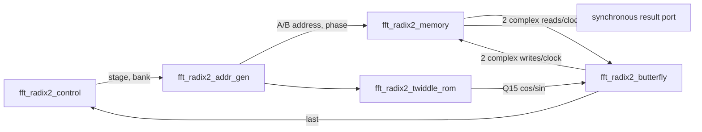

# FFT radix-2 dùng cho MDCT AAC-LC

Đây là phiên bản đã chốt của FFT phức dùng bên trong DCT-IV/MDCT. Core chỉ dùng
radix-2 DIT, hỗ trợ FFT-64 và FFT-512 tại runtime, đồng thời giữ số học tương
thích đường AAC-LC của FDK-AAC.

Profile duy nhất của thiết kế là `FDK_AACLC_1024_Q31Q15_RAD2_V1`:

| Thuộc tính | Giá trị đã chốt |
|---|---|
| Dữ liệu Re/Im | signed Q1.31, 32 bit |
| Hệ số twiddle | signed Q1.15, 16 bit |
| Chiều FFT | forward, `exp(-j·2πkn/N)` |
| Kích thước | 64 (`size_mode=0`) hoặc 512 (`size_mode=1`) |
| Thứ tự vào/ra | natural / natural; RTL bit-reverse khi nạp |
| Scale theo stage | FFT-64: `101111`; FFT-512: `101111111` |
| `scale_exp` | 5 cho FFT-64; 8 cho FFT-512 |
| Lượng tử hóa | dịch phải số học, bỏ phần dư; không rounding |
| Overflow | wrap two's-complement 32 bit; không saturation |

Chuỗi `101111` được đọc từ stage 1 đến stage cuối: stage 1 giảm một bit,
stage 2 không giảm, các stage còn lại giảm một bit. Đây là cách tách thuần
radix-2 nhưng vẫn giữ đúng thứ tự phép toán của kernel radix-4 gộp trong FDK.

## Cấu trúc RTL

Top-level chỉ nối các khối; control, địa chỉ, RAM và số học không còn trộn trong
một process lớn.



| Tệp | Trách nhiệm duy nhất |
|---|---|
| `rtl/fft_radix2_pkg.vhd` | kiểu dữ liệu, bit-reverse, wrap32 và nhân Q31×Q15 |
| `rtl/fft_radix2_control.vhd` | protocol load/start/done, stage và đổi bank |
| `rtl/fft_radix2_addr_gen.vhd` | sinh A/B/phase bằng counter tăng dần |
| `rtl/fft_radix2_memory.vhd` | hai bank ping-pong, mỗi word phức 64 bit |
| `rtl/fft_radix2_twiddle_rom.vhd` | 65 điểm octant Q15 sinh từ FDK |
| `rtl/fft_radix2_butterfly.vhd` | pipeline ba register-stage, bốn tích thực song song |
| `rtl/fft_radix2_core.vhd` | top structural và các assertion giao tiếp |

## Ba tối ưu kiến trúc chính

### 1. Control và datapath độc lập

Controller chỉ biết số mẫu, số stage và bank nguồn/đích. Butterfly không biết
frame hay kích thước FFT. Vì vậy có thể thay đổi chiều sâu pipeline mà không
viết lại FSM, và lỗi protocol được bắt bằng assertion riêng.

### 2. Address generator tăng dần

Trong một stage, khối giữ `group_base`, `j` và `phase`:

```text
addr_a = group_base + j
addr_b = addr_a + half
phase  = j * 2^(9-stage)
```

Phép nhân của dòng cuối chỉ xuất hiện khi khởi tạo; khi chạy, `phase` tăng bằng
`tw_step`. Đường lặp mỗi clock chỉ còn compare và add, không còn division,
modulo hay multiplier địa chỉ theo từng butterfly.

### 3. Pipeline và butterfly song song

Một butterfly mới được issue mỗi clock:

| Nhịp pipeline | Công việc |
|---|---|
| đọc RAM | đọc đồng thời A và B từ bank nguồn |
| P0 | chốt operand, twiddle và địa chỉ đích |
| P1 | bốn phép nhân Q31×Q15 song song hoặc bypass `W=1`, `W=-j` |
| P2 | cộng/trừ, wrap32 và ghi hai kết quả |

Hai bank ping-pong loại bỏ read-after-write của pipeline in-place. Trong mỗi
stage, bank nguồn chỉ đọc còn bank đích chỉ ghi; sau butterfly cuối hai vai trò
được đổi. GHDL synthesis-elaboration nhận hai RAM, mỗi RAM rộng 64 bit và sâu
512 word.

## Luồng một frame

1. Khi `load_ready=1`, đưa `ld_idx=0..N-1` liên tục cùng `ld_en=1`.
2. `size_mode` phải giữ nguyên từ mẫu đầu đến khi xong FFT.
3. Phát `start` một clock riêng sau khi đã nạp đúng N mẫu.
4. `busy=1` trong toàn bộ phép biến đổi; không load/read khi đang busy.
5. `done=1` đúng một clock sau khi kết quả cuối được commit.
6. Khi `busy=0`, phát `rd_en`; một clock sau `rd_valid=1` và dữ liệu `rd_idx`
   xuất hiện theo thứ tự bin tự nhiên.

Input được ghi vào địa chỉ bit-reversed 6 hoặc 9 bit. Nhờ vậy các stage DIT đọc
tuần tự theo cặp và output cuối đã ở natural order, không cần pass reorder sau
FFT.

## Latency và thông lượng

Pipeline issue một butterfly/clock. Từ clock nhận `start` đến `done`:

```text
run_cycles = log2(N) × (N/2 + 5)
```

| Mode | Compute cycles | Thời gian ở 100 MHz |
|---|---:|---:|
| FFT-64 | 222 | 2,22 µs |
| FFT-512 | 2349 | 23,49 µs |

Các số này chưa gồm N clock nạp input và N clock đọc output. Đây là latency đã
được testbench đo, không phải ước lượng.

## Trạng thái kiểm chứng

Kết quả regression ngày 2026-08-24:

- C++ so Python integer: 2.560/2.560 bin khớp, 0 LSB;
- trace C++ so Python: 10.752/10.752 hàng stage khớp, 0 LSB;
- RTL so golden: 12 frame, 2.560 bin và mọi ranh giới stage khớp, 0 LSB;
- radix-2 thuần so cổng trực tiếp `dit_fft` FDK: 36.864 bin khớp, 0 LSB;
- GHDL synthesis-elaboration: PASS, suy luận 2 × RAM 512×64.

NumPy float64 chỉ là kiểm tra toán học độc lập: RMS 440,53 LSB Q31, SNR
97,30 dB trên bộ regression hiện tại. Cổng chấp nhận chính vẫn là integer
bit-exact 0 LSB.

Vivado không có trên máy kiểm tra hiện tại nên chưa có số LUT/DSP/Fmax hậu
route. `synth/vivado_fft_runtime.tcl` đã chạy đầy đủ synth/place/route và tạo
báo cáo khi được gọi trên máy có Vivado. Không được dùng con số tài nguyên ước
lượng thay cho báo cáo đó.

Xem đặc tả số học ở [dactafftcor.md](dactafftcor.md) và các lệnh chạy ở
[huongdanchay.md](huongdanchay.md).
