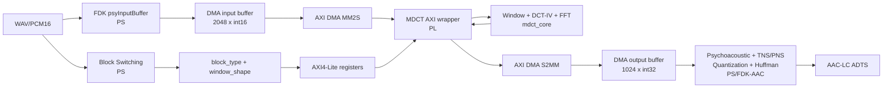

# Tổng quan sử dụng hai repo Xilinx cho AAC-LC HW/SW codesign trên PYNQ-Z2

## 1. Mục đích

Tài liệu này trình bày cách khai thác hai workshop của Xilinx:

- [xup_fpga_vivado_flow](https://github.com/Xilinx/xup_fpga_vivado_flow): luồng phát triển RTL/FPGA bằng Vivado;
- [xup_embedded_system_design_flow](https://github.com/Xilinx/xup_embedded_system_design_flow): luồng xây dựng hệ thống Zynq PS–PL bằng Vivado và Vitis.

Hai repo này là **tài liệu và thiết kế mẫu**, không phải framework để chép nguyên vào dự án AAC-LC. Vai trò của chúng là cung cấp quy trình chuẩn, ví dụ IP Integrator, AXI, DMA, debug và export hardware. Source AAC-LC, RTL MDCT và hợp đồng số học vẫn lấy từ repository hiện tại.

Kiến trúc đích được giữ thống nhất với
[PYNQ_Z2_DEPLOYMENT_PLAN.md](PYNQ_Z2_DEPLOYMENT_PLAN.md):

- AAC-LC, PCM16, mono, 48 kHz, 1024 mẫu/kênh/frame trong phiên bản đầu;
- Block Switching và phần còn lại của FDK-AAC chạy trên ARM Cortex-A9;
- Window/MDCT chạy trên PL;
- AXI4-Lite dùng cho điều khiển;
- AXI DMA MM2S/S2MM dùng để chuyển PCM và phổ MDCT qua cổng HP của Zynq PS;
- Linux/PYNQ là môi trường production; bare-metal Vitis chỉ nên dùng cho bring-up và chẩn đoán ban đầu.

---

## 2. Vai trò của từng repo

### 2.1 `xup_fpga_vivado_flow`: từ RTL đến bitstream

Repo này phù hợp với phần **thuần FPGA** của dự án:

```text
VHDL mdct_core
  -> simulation
  -> synthesis
  -> utilization report
  -> implementation
  -> static timing analysis
  -> bitstream
  -> ILA/debug trên PL
```

Áp dụng trực tiếp cho:

- `my_workspace/window_mdct/rtl/`;
- `my_workspace/window_mdct/fft_radix2_core/rtl/`;
- testbench và golden vector của Window/MDCT;
- kiểm tra core có fit và đạt timing trên `xc7z020clg400-1` hay không;
- kiểm tra RAM có được suy luận thành BRAM và multiplier có dùng DSP hợp lý không;
- quan sát giao thức native của core và sau đó là AXI4-Stream bằng ILA.

Repo này **không giải quyết** phần Cortex-A9, Linux, DMA buffer, cache coherence hoặc tích hợp FDK-AAC.

### 2.2 `xup_embedded_system_design_flow`: ghép PS, PL và phần mềm

Repo này phù hợp với phần **system integration**:

```text
Zynq PS
  + custom MDCT IP
  + AXI4-Lite
  + AXI DMA
  + DDR qua S_AXI_HP0
  + interrupt
  -> export XSA/bitstream
  -> driver/HAL
  -> ứng dụng AAC-LC trên Cortex-A9
```

Áp dụng trực tiếp cho:

- cấu hình ZYNQ7 Processing System;
- tạo và đóng gói custom IP;
- gán địa chỉ thanh ghi AXI4-Lite;
- bật `S_AXI_HP0` để PL truy cập DDR của PS;
- kết nối interrupt PL-to-PS;
- export hardware để kiểm thử bare-metal hoặc tạo overlay PYNQ;
- debug đồng thời phần mềm và tín hiệu phần cứng.

Điểm cần phân biệt: Lab 7 của repo dùng **AXI CDMA**, tức truyền memory-to-memory qua giao diện memory-mapped. MDCT của dự án nhận/phát AXI4-Stream, nên thiết kế production phải dùng **AXI DMA** với kênh:

- MM2S: DDR chứa PCM → stream input của MDCT;
- S2MM: stream output của MDCT → DDR chứa spectrum.

Lab 7 vẫn rất hữu ích để học cách bật HP port, nối clock/reset, interrupt, address map và kiểm tra truyền DMA, nhưng không được sao chép CDMA như kiến trúc cuối.

---

## 3. Chuẩn bị và cách đọc hai repo

### 3.1 Lấy source tham khảo

Có thể clone hai repo vào một thư mục tham khảo riêng, không trộn source lab với RTL production:

```powershell
git clone https://github.com/Xilinx/xup_fpga_vivado_flow
git clone https://github.com/Xilinx/xup_embedded_system_design_flow
```

Nên giữ đường dẫn ngắn và chỉ dùng ký tự ASCII vì workshop được viết cho Vivado 2021.2 trên Windows và có cảnh báo về giới hạn độ dài đường dẫn.

Không commit các project Vivado sinh tự động như `.Xil`, `*.cache`, `*.runs`, `*.gen` vào repository AAC. Chỉ đưa vào version control:

- RTL, testbench và golden vector;
- Tcl tạo project/block design/package IP;
- XDC cần thiết;
- register map;
- driver/HAL;
- báo cáo synthesis, timing và utilization dùng để nghiệm thu;
- `.bit`, `.hwh` hoặc `.xsa` nếu chính sách artifact của dự án cho phép.

### 3.2 Board và phiên bản công cụ

Hai workshop dùng Vivado/Vitis 2021.2 và hỗ trợ PYNQ-Z2. Part chính xác là:

```text
xc7z020clg400-1
```

Nếu Vivado không có board definition PYNQ-Z2, có hai cách:

1. cài board files và chọn board PYNQ-Z2;
2. chọn trực tiếp part `xc7z020clg400-1`, sau đó tự cấu hình Zynq PS và constraint cần thiết.

Đối với dự án này, chọn part trực tiếp là đủ cho synthesis standalone của MDCT. Khi dựng Processing System, board preset thuận tiện hơn vì cấu hình DDR, MIO, UART và clock đúng với board.

Nếu dùng Vivado mới hơn 2021.2:

- không phụ thuộc tuyệt đối vào vị trí menu trong ảnh của workshop;
- kiểm tra lại version của AXI DMA, Processor System Reset và Interconnect/SmartConnect;
- regenerate output products và khóa version IP trong Tcl;
- không giả định XSA, HWH hoặc driver do 2021.2 sinh ra tương thích nguyên trạng với image PYNQ đang chạy;
- luôn chạy lại synthesis, implementation và hardware test trên đúng toolchain đã chọn.

---

## 4. Ánh xạ các lab của `xup_fpga_vivado_flow`

| Lab | Nội dung workshop | Ánh xạ vào AAC-LC | Artifact cần lấy |
|---|---|---|---|
| Lab 1 | Tạo RTL project, mô phỏng, synthesize, implement, program FPGA | Tạo project standalone cho `mdct_core`; thêm toàn bộ VHDL và testbench; chọn đúng XC7Z020 | Tcl/project tối thiểu, simulation log |
| Lab 2 | Synthesis và phân tích report | Kiểm tra hierarchy của Window/Fold, DCT-IV, FFT; BRAM/DSP inference; tránh RAM bung thành FF/LUT | `utilization_post_synth.rpt`, synthesis warnings |
| Lab 3 | Implementation và static timing analysis | Đặt clock 100 MHz, route core trên XC7Z020, kiểm tra WNS/TNS và unconstrained paths | `timing_post_route.rpt`, `utilization_post_route.rpt` |
| Lab 4 | IP Catalog, clock resource, FIFO và IP Integrator | Tham khảo cách dùng FIFO/skid buffer ở biên AXI stream; không cần Clocking Wizard nếu toàn hệ thống dùng FCLK 100 MHz | Thiết kế buffering và reset rõ ràng |
| Lab 5 | I/O planning và timing constraints | Chỉ lấy phương pháp quản lý XDC/timing; MDCT không cần chân GPIO riêng vì nằm trong block design PS–PL | XDC clock/reset tối thiểu |
| Lab 6 | Mark Debug và ILA | Bắt `TVALID/TREADY/TLAST`, FSM wrapper, `start/busy/done`, error flags và frame ID trên board | Cấu hình ILA cho debug build |

### Cách áp dụng theo thứ tự

1. Chạy lại regression GHDL/golden hiện có để khóa chức năng.
2. Sửa Tcl standalone từ part Artix-7 hiện tại sang `xc7z020clg400-1`.
3. Synthesize `mdct_core` với `ENABLE_TRACE=false`.
4. Kiểm tra report theo hierarchy, đặc biệt RAM FFT ping-pong và spectrum memory.
5. Implement ở 100 MHz và xử lý timing trước khi thêm AXI.
6. Sau khi có wrapper, lặp lại toàn bộ flow cho **wrapper + core**, vì timing của core standalone không chứng minh timing của hệ tích hợp.
7. Chỉ thêm ILA vào debug build; không dùng utilization/timing của debug build làm số liệu production.

Các script hiện có là điểm bắt đầu:

- [vivado_mdct_runtime.tcl](window_mdct/synth/vivado_mdct_runtime.tcl);
- [mdct_core.xdc](window_mdct/synth/mdct_core.xdc);
- [vivado_fft_runtime.tcl](window_mdct/fft_radix2_core/synth/vivado_fft_runtime.tcl);
- [fft_radix2_core.xdc](window_mdct/fft_radix2_core/synth/fft_radix2_core.xdc).

---

## 5. Ánh xạ các lab của `xup_embedded_system_design_flow`

| Lab | Nội dung workshop | Ánh xạ vào AAC-LC | Mức ưu tiên |
|---|---|---|---|
| Lab 1 | Zynq PS, DDR, UART, clock | Tạo nền Processing System, DDR và FCLK 100 MHz | Cao |
| Lab 2 | Bật GP master và thêm AXI GPIO | Học cách PS điều khiển slave AXI; thay GPIO bằng register bank của MDCT và AXI DMA | Cao |
| Lab 3 | Create and Package IP, AXI4-Lite, IP repository, Address Editor | Đóng gói `mdct_axi_wrapper` cùng `mdct_core`; khai báo AXI4-Lite và AXI4-Stream | Rất cao |
| Lab 4 | Phần mềm truy cập peripheral/BRAM | Mẫu bring-up thanh ghi: đọc `IP_ID`, ghi config, kiểm tra status | Trung bình |
| Lab 5 | Timer và software debug | Đo latency, timeout và deadline từng frame trên Cortex-A9 | Trung bình |
| Lab 6 | VIO, ILA, debug AXI và Vitis | Debug handshake DMA/MDCT, interrupt, lỗi TLAST và state machine | Rất cao |
| Lab 7 | HP port, CDMA, interrupt và truyền qua DDR/BRAM | Kế thừa HP0, clock/reset, IRQ và phương pháp kiểm thử DMA; thay CDMA bằng AXI DMA streaming | Rất cao |
| Lab 8 | Boot SD/QSPI và nạp bitstream | Dùng khi cần image standalone/boot cố định; overlay PYNQ giai đoạn đầu chưa cần flow này | Thấp lúc đầu |

### Phần có thể tái sử dụng về ý tưởng

- cấu hình PS và board preset;
- `M_AXI_GP0` cho AXI4-Lite control;
- `S_AXI_HP0` cho lưu lượng DDR từ DMA;
- Processor System Reset theo clock PL;
- `IRQ_F2P` cho DMA/wrapper interrupt;
- Address Editor và kiểm tra vùng địa chỉ;
- export hardware và smoke test trên Cortex-A9;
- ILA/VIO và quy trình debug HW/SW.

### Phần phải thay đổi cho dự án AAC

- peripheral LED mẫu → `mdct_axi_wrapper`;
- vài thanh ghi mẫu → register map version hóa của MDCT;
- CDMA memory-to-memory → AXI DMA MM2S/S2MM;
- bare-metal application → HAL độc lập, sau đó tích hợp vào FDK-AAC trên Linux/PYNQ;
- buffer BRAM nhỏ → DMA-safe buffer trong DDR;
- dữ liệu số nguyên thử nghiệm → snapshot `2048 × int16` và spectrum `1024 × int32`;
- kiểm tra “đọc/ghi được” → kiểm tra bit-exact 0 LSB và đúng exponent.

---

## 6. Kiến trúc HW/SW codesign đích



### Phân chia phần cứng/phần mềm

| Chức năng | PS hay PL | Lý do |
|---|---|---|
| Đọc WAV/PCM, file I/O | PS | Linux xử lý I/O thuận tiện |
| `psyInputBuffer`, overlap và look-ahead | PS | FDK-AAC đã quản lý đúng state |
| Block Switching | PS | Nhiều control/state, chi phí tính toán nhỏ |
| Window/fold | PL | Datapath cố định, nằm trong MDCT core |
| DCT-IV pre/post rotation | PL | Fixed-point datapath |
| FFT-64/FFT-512 | PL | Phần tính toán chính của MDCT |
| Psychoacoustic, TNS, PNS, M/S stereo | PS | Logic phức tạp đã có trong FDK |
| Quantization, bit reservoir, Huffman, ADTS | PS | Giữ nguyên FDK để giảm rủi ro conformance |
| Điều khiển frame và lỗi | PS + wrapper PL | PS điều phối; wrapper bảo vệ giao thức phần cứng |

### Kết nối block design đề xuất

```text
processing_system7_0/M_AXI_GP0
  -> AXI Interconnect/SmartConnect
  -> mdct_axi_wrapper/S_AXI_CONTROL
  -> axi_dma/S_AXI_LITE

axi_dma/M_AXI_MM2S
  -> SmartConnect
  -> processing_system7_0/S_AXI_HP0

axi_dma/M_AXI_S2MM
  -> SmartConnect
  -> processing_system7_0/S_AXI_HP0

axi_dma/M_AXIS_MM2S
  -> mdct_axi_wrapper/S_AXIS_PCM

mdct_axi_wrapper/M_AXIS_SPEC
  -> axi_dma/S_AXIS_S2MM

processing_system7_0/FCLK_CLK0 = 100 MHz
  -> AXI DMA, interconnect, wrapper và mdct_core

axi_dma/mm2s_introut, axi_dma/s2mm_introut, wrapper_irq
  -> xlconcat
  -> processing_system7_0/IRQ_F2P
```

Phiên bản đầu dùng một clock domain 100 MHz để tránh CDC. Chỉ thêm clock khác khi report chứng minh cần thiết.

---

## 7. Hợp đồng dữ liệu không được làm sai khi tích hợp

### 7.1 Input một frame

| Trường | Kích thước | Nguồn |
|---|---:|---|
| `frame_id` | 32 bit | HAL/PS |
| `block_type` | 2 bit | Block Switching FDK |
| `right_shape` | 1 bit | FDK window decision |
| `clear_history` | 1 bit | PS, chỉ bật đầu stream/reset |
| PCM snapshot | `2048 × int16` | `psyInputBuffer` |

Đóng gói AXI4-Stream input 32 bit:

```text
TDATA[15:0]  = pcm[2*i]
TDATA[31:16] = pcm[2*i+1]
i = 0..1023
TLAST = 1 tại i = 1023
```

Metadata được ghi qua AXI4-Lite trước khi MM2S chạy. Wrapper chỉ phát `start` cho core sau khi nhận đủ payload và TLAST hợp lệ.

### 7.2 Output một frame

| Trường | Kích thước | Đích |
|---|---:|---|
| Spectrum | `1024 × int32`, Q31 | FDK psychoacoustic/quantizer |
| `mdct_exp` | 5 bit dùng chung frame | Scale metadata của FDK |
| `frame_id_out` | 32 bit | Kiểm tra đồng bộ |
| `error_flags` | 32 bit | HAL/log |
| `cycle_count` | 32 bit | Profiling |

AXI4-Stream output có một bin Q31 mỗi beat 32 bit và TLAST tại bin 1023.

Exponent bắt buộc:

| Block type | `mdct_exp` |
|---|---:|
| LONG | 12 |
| START | 12 |
| SHORT | 9 |
| STOP | 12 |

Không được chỉ so 1024 mantissa rồi bỏ qua exponent. Cặp `(spectrum, mdct_exp)` mới là kết quả MDCT đầy đủ.

Đặc tả chi tiết nằm tại [mdct_core.md](window_mdct/docs/mdct_core.md) và
[dactafftcor.md](window_mdct/fft_radix2_core/docs/dactafftcor.md).

---

## 8. Quy trình triển khai đề xuất

### Giai đoạn A — khóa baseline phần mềm và số học

**Trạng thái khởi động:** cấu hình baseline đầu tiên đã được khóa ở AAC-LC,
mono, signed PCM16, 48 kHz, ADTS, CBR 64 kb/s và bật afterburner. Corpus smoke
test là `input/abc_votay.wav` (mono/48 kHz/PCM16). Hướng dẫn và script native:

- [Build/run software baseline trên Cortex-A9](pynq_z2/docs/phase_a_software_baseline.md);
- [`run_phase_a_native.sh`](pynq_z2/sw/scripts/run_phase_a_native.sh).

Các mục đã chuẩn bị trong repository không thay thế lượt chạy thật trên board:

- [x] khóa cấu hình và corpus smoke test;
- [x] chuẩn bị CMake Release build, self-test, encode, timing, decode và checksum;
- [ ] chạy script trên PYNQ-Z2 và lưu artifact ARM;
- [ ] instrument trace block/window/PCM/spectrum/exponent trên ARM;
- [ ] chạy toàn bộ regression số học và version hóa golden.

1. Khóa cấu hình mono, PCM16, 48 kHz, AAC-LC, ADTS.
2. Build FDK-AAC software thuần trên chính Cortex-A9/PYNQ-Z2.
3. Encode corpus chuẩn và lưu:
   - block sequence;
   - window shape;
   - 2048 PCM snapshot mỗi frame;
   - 1024 Q31 spectrum và exponent;
   - AAC output và file decode lại.
4. Chạy regression hiện có của Block Switching, INPUT, FFT và MDCT.
5. Dùng kết quả ARM làm oracle tích hợp; không chỉ dùng executable x86 vì FDK có thể chọn nhánh tối ưu theo kiến trúc.

**Cổng qua giai đoạn:** software encoder chạy end-to-end trên board và bộ golden đã được version hóa.

### Giai đoạn B — port MDCT standalone sang XC7Z020

Áp dụng Lab 1–3 của `xup_fpga_vivado_flow`:

1. tạo Vivado RTL project hoặc Tcl batch cho `xc7z020clg400-1`;
2. thêm toàn bộ RTL Window/MDCT và FFT;
3. đặt clock 10 ns;
4. synthesize và kiểm tra BRAM/DSP inference;
5. implement, route và kiểm tra WNS;
6. lưu report theo hierarchy.

**Cổng qua giai đoạn:** route PASS, WNS ≥ 0 tại 100 MHz, không có unconstrained critical path và tài nguyên nằm trong XC7Z020.

### Giai đoạn C — tạo AXI wrapper và đóng gói custom IP

Áp dụng Embedded Lab 3:

1. tạo `mdct_axi_wrapper` có:
   - AXI4-Lite slave;
   - AXI4-Stream slave nhận PCM;
   - AXI4-Stream master phát spectrum;
   - FSM bridge sang giao diện native của `mdct_core`;
   - error flags, frame ID và cycle counter;
2. testbench các trường hợp normal, backpressure, early/missing TLAST, reset và start-while-busy;
3. package IP với interface metadata đúng;
4. thêm IP repository vào project hệ thống;
5. version hóa VLNV và register map.

Không cần sửa `mdct_core` để chứa logic AXI. Tách wrapper giúp giữ nguyên core bit-exact và cho phép regression native tiếp tục hoạt động.

**Cổng qua giai đoạn:** wrapper không làm thay đổi bất kỳ sample/bin nào và xử lý đúng mọi handshake.

### Giai đoạn D — dựng Zynq block design

Áp dụng Embedded Lab 1–3 và kiến thức IP Integrator của FPGA Lab 4:

1. thêm ZYNQ7 Processing System và apply PYNQ-Z2 preset;
2. bật `M_AXI_GP0`, `S_AXI_HP0`, `FCLK_CLK0` và `IRQ_F2P`;
3. thêm AXI DMA, tắt Scatter-Gather ở phiên bản đầu;
4. thêm MDCT custom IP;
5. nối control path, data path, clock, reset và interrupt;
6. assign address cho DMA và wrapper;
7. validate block design;
8. tạo HDL wrapper, synthesize, implement và generate bitstream;
9. export `.xsa`; với PYNQ overlay đồng thời lấy `.bit` và `.hwh` cùng build.

**Cổng qua giai đoạn:** overlay load được, đọc đúng `IP_ID/IP_VERSION`, DMA và wrapper đều reset về idle.

### Giai đoạn E — bring-up DMA và HAL độc lập

Áp dụng các nguyên tắc của Embedded Lab 4, 5 và 7:

1. viết chương trình nhỏ chưa liên quan FDK để:
   - đọc/ghi register;
   - cấp phát input/output DMA-safe;
   - nạp một golden frame;
   - chạy S2MM trước, MM2S sau;
   - chờ completion bằng polling;
   - kiểm tra frame ID, flags, exponent và 1024 bin;
2. xử lý cache đúng:
   - flush input trước MM2S;
   - invalidate output sau S2MM;
3. thêm timeout và quy trình reset DMA/wrapper;
4. sau khi polling ổn định mới chuyển sang interrupt nếu cần.

HAL phải độc lập với FDK, ví dụ API logic:

```c
int mdct_pl_run(
    const int16_t pcm[2048],
    uint32_t frame_id,
    uint32_t frame_config,
    int32_t spectrum[1024],
    uint32_t *mdct_exp);
```

**Cổng qua giai đoạn:** board trả đúng 1024/1024 bin 0 LSB trên toàn bộ golden corpus, exponent và state history đúng.

### Giai đoạn F — tích hợp backend PL vào FDK-AAC

1. tạo abstraction backend thay vì gọi DMA trực tiếp rải rác trong FDK;
2. giữ software backend nguyên bản để A/B test;
3. tại điểm gọi `FDKaacEnc_Transform_Real`, PL backend:
   - nhận đúng snapshot 2048 mẫu;
   - nhận block type/window shape;
   - gọi HAL;
   - trả 1024 mantissa cùng exponent về đúng field FDK;
4. không fallback âm thầm giữa software và PL ở giữa stream vì window history có state;
5. khi lỗi DMA/core, log frame ID, reset stream có kiểm soát và báo lỗi lên encoder.

**Cổng qua giai đoạn:** cùng một input trên cùng bản ARM cho kết quả software backend và PL backend tương đương theo tiêu chí đã khóa.

### Giai đoạn G — debug và tối ưu

Áp dụng FPGA Lab 6 và Embedded Lab 6:

- ILA probe tối thiểu:
  - MM2S/S2MM `TVALID`, `TREADY`, `TLAST`, `TDATA` lấy mẫu;
  - wrapper state;
  - `start`, `busy`, `done`;
  - input/output counters;
  - frame ID và error flags;
- đo riêng:
  - cache maintenance;
  - DMA setup;
  - MM2S;
  - MDCT compute;
  - S2MM;
  - tổng thời gian một frame;
  - CPU load của toàn encoder.

Chỉ tối ưu batching, persistent DMA, interrupt hoặc ring buffer trong PL sau khi bản 2048-sample/frame đã bit-exact.

### Giai đoạn H — đóng gói chạy độc lập

Embedded Lab 8 chỉ cần khi mục tiêu chuyển từ overlay thử nghiệm sang:

- boot SD/QSPI độc lập;
- bare-metal demo;
- image cố định có bitstream và application.

Với Linux/PYNQ, giai đoạn đầu chỉ cần load `.bit` + `.hwh` khi chạy ứng dụng; chưa cần tạo `BOOT.BIN` mới.

---

## 9. Cấu trúc thư mục nên tạo

```text
my_workspace/
├── z2.md
├── PYNQ_Z2_DEPLOYMENT_PLAN.md
├── pynq_z2/
│   ├── hw/
│   │   ├── rtl/
│   │   │   └── mdct_axi_wrapper.vhd
│   │   ├── tb/
│   │   ├── ip_repo/
│   │   ├── tcl/
│   │   │   ├── package_mdct_ip.tcl
│   │   │   ├── create_block_design.tcl
│   │   │   ├── build_bitstream.tcl
│   │   │   └── export_overlay.tcl
│   │   ├── constraints/
│   │   └── reports/
│   ├── overlay/
│   │   ├── aac_mdct.bit
│   │   └── aac_mdct.hwh
│   ├── sw/
│   │   ├── hal/
│   │   ├── tests/
│   │   ├── fdk_backend/
│   │   └── scripts/
│   │       └── run_phase_a_native.sh
│   └── docs/
│       ├── register_map.md
│       ├── build_vivado.md
│       ├── deploy_pynq.md
│       ├── phase_a_software_baseline.md
│       └── validation_report.md
├── window_mdct/
├── block_switch/
└── INPUT/
```

Không copy RTL MDCT sang `pynq_z2/hw/rtl`; Tcl/IP Packager nên tham chiếu source gốc trong `window_mdct/rtl` và `window_mdct/fft_radix2_core/rtl`. Chỉ wrapper tích hợp mới nằm trong cây `pynq_z2`.

---

## 10. Ma trận artifact từ workshop sang dự án

| Khái niệm trong workshop | Artifact AAC-LC tương ứng |
|---|---|
| RTL project mẫu | Tcl synthesize `mdct_core` trên XC7Z020 |
| Synthesis report | Báo cáo LUT/FF/BRAM/DSP theo hierarchy MDCT |
| Static timing lab | Timing report 100 MHz của core và top tích hợp |
| FIFO/IP Catalog | Skid buffer/FIFO ở biên AXI stream nếu cần |
| AXI LED peripheral | Register bank `mdct_axi_wrapper` |
| Custom IP package | IP chứa AXI wrapper + toàn bộ MDCT hierarchy |
| GPIO software test | Smoke test đọc `IP_ID`, status và config |
| CDMA lab | Mẫu HP0/IRQ/DMA bring-up, được chuyển sang AXI DMA |
| BRAM transfer data | PCM input và Q31 spectrum đặt trong DDR DMA-safe |
| Vitis standalone app | Board smoke test/HAL test trước Linux integration |
| ILA/VIO lab | Debug TLAST, backpressure, FSM và frame mismatch |
| Export hardware | `.xsa`, hoặc `.bit` + `.hwh` cho PYNQ overlay |
| SD/QSPI boot lab | Bước product hóa tùy chọn sau khi overlay ổn định |

---

## 11. Mono trước, stereo sau

Phiên bản mono dùng một context cửa sổ trong MDCT core và một transaction mỗi frame. Đây là phạm vi phù hợp để nghiệm thu luồng AXI/DMA trước.

Khi mở rộng stereo:

- Block Switching chạy riêng L/R rồi đồng bộ bằng logic FDK trên PS;
- mỗi kênh có `psyInputBuffer[2048]` riêng;
- số transaction MDCT tăng thành hai mỗi frame;
- DMA traffic gần gấp đôi nhưng vẫn nhỏ so với khả năng HP0;
- state window/history không được dùng chung sai giữa hai kênh;
- phải chọn một trong ba kiến trúc:
  1. hai core MDCT độc lập;
  2. một core time-multiplex có hai context nội bộ;
  3. một core stateless với context save/restore từ PS.

Khuyến nghị đầu tiên là **một core time-multiplex có context theo channel ID**, nếu latency hai lượt vẫn thấp hơn deadline 21,33 ms tại 48 kHz. Chỉ nhân đôi core khi report timing/latency thực chứng minh cần thiết.

---

## 12. Kiểm chứng và tiêu chí nghiệm thu

### 12.1 Bốn tầng kiểm chứng

| Tầng | Phạm vi | Oracle/tiêu chí |
|---|---|---|
| 1 | RTL native | Golden vector hiện có, 0 LSB |
| 2 | AXI wrapper simulation | Không mất/đổi mẫu dưới backpressure và lỗi protocol được bắt |
| 3 | Hardware-in-the-loop | Board output = ARM/golden, 1024/1024 bin và exponent đúng |
| 4 | Encoder end-to-end | AAC hợp lệ, decoder đọc được, block/window sequence đúng |

### 12.2 Checklist bắt buộc

- [ ] Target đúng `xc7z020clg400-1`.
- [ ] Vivado synthesis và implementation PASS.
- [ ] WNS không âm tại 100 MHz.
- [ ] Không có unconstrained critical path.
- [ ] BRAM/DSP inference được kiểm tra bằng report thật.
- [ ] AXI stream xử lý đúng backpressure và TLAST.
- [ ] Cache flush/invalidate đúng trước/sau DMA.
- [ ] Có timeout, reset và error logging.
- [ ] Spectrum khớp 0 LSB trên board.
- [ ] `mdct_exp` đúng cho LONG/START/SHORT/STOP.
- [ ] Window history đúng qua chuỗi chuyển block.
- [ ] Encoder software-only chạy được trên Cortex-A9.
- [ ] Encoder PL-backend tạo AAC-LC ADTS hợp lệ.
- [ ] Đo được latency, throughput và CPU load.

---

## 13. Các sai lầm dễ gặp khi dùng hai repo mẫu

1. **Chọn sai FPGA part.** Script cũ của MDCT đang nhắm Artix-7; phải đổi sang XC7Z020 và lấy report mới.
2. **Sao chép CDMA vào kiến trúc stream.** CDMA Lab 7 không nối trực tiếp với AXI4-Stream của MDCT; production cần AXI DMA.
3. **Chỉ test peripheral register.** Đọc/ghi AXI4-Lite thành công chưa chứng minh đường MM2S/S2MM hoặc số học MDCT đúng.
4. **Dùng địa chỉ virtual thông thường cho DMA.** Buffer phải DMA-safe/physically contiguous theo cơ chế của image PYNQ/Linux đang dùng.
5. **Bỏ cache maintenance.** Đây có thể gây dữ liệu cũ dù DMA báo hoàn thành.
6. **Bỏ qua exponent.** Spectrum mantissa đúng nhưng exponent sai vẫn làm sai toàn bộ encoder phía sau.
7. **Phát `start` bằng CPU không đồng bộ với payload.** Wrapper nên dùng việc nhận đủ dữ liệu và TLAST làm điều kiện bắt đầu core.
8. **Không xử lý output backpressure.** Cổng đọc spectrum có latency; wrapper cần FIFO/skid buffer phù hợp.
9. **Giữ ILA trong build đo tài nguyên cuối.** ILA làm thay đổi utilization, routing và timing.
10. **Trộn state software và PL giữa stream.** Không fallback giữa hai backend nếu chưa đồng bộ window history.
11. **Tin tuyệt đối vào hướng dẫn GUI 2021.2.** Tên IP, menu và automation có thể thay đổi ở Vivado mới; Tcl và report của build thực mới là nguồn xác nhận.
12. **Mở rộng stereo quá sớm.** Mono phải qua đủ regression, HIL và end-to-end trước.

---

## 14. Thứ tự đọc và thực hành ngắn nhất

Nếu mục tiêu là đi thẳng tới hệ AAC-LC, không cần làm toàn bộ hai workshop theo thứ tự tuyến tính.

### Nhánh FPGA

1. FPGA Lab 1: project, simulation, synthesis, bitstream.
2. FPGA Lab 2: synthesis report.
3. FPGA Lab 3: implementation và timing.
4. FPGA Lab 6: ILA, chỉ đọc/làm khi bắt đầu board debug.
5. FPGA Lab 4: đọc phần FIFO/IP Integrator khi thiết kế wrapper.

### Nhánh embedded

1. Embedded Lab 1: Zynq PS, DDR, UART và clock.
2. Embedded Lab 2: GP AXI path.
3. Embedded Lab 3: package custom AXI IP và Address Editor.
4. Embedded Lab 7: HP port, DMA và interrupt; chủ động thay CDMA bằng AXI DMA.
5. Embedded Lab 6: hardware/software debug.
6. Embedded Lab 4–5: software peripheral/timer nếu cần bare-metal bring-up.
7. Embedded Lab 8: chỉ khi cần boot image độc lập.

---

## 15. Kết luận thực thi

Hai repo Xilinx ghép lại thành một lộ trình hoàn chỉnh nhưng có ranh giới rõ:

```text
xup_fpga_vivado_flow
  = chứng minh RTL MDCT đúng, fit và đạt timing trên XC7Z020

xup_embedded_system_design_flow
  = đưa MDCT thành custom IP, nối với Zynq PS, DDR, DMA và phần mềm

repository AAC hiện tại
  = nguồn thuật toán, fixed-point contract, golden vector và FDK-AAC production
```

Đường triển khai ngắn nhất là:

```text
ARM software baseline
  -> MDCT standalone trên XC7Z020
  -> AXI wrapper
  -> custom IP
  -> Zynq + AXI DMA + HP0
  -> HAL golden-frame test
  -> FDK PL backend
  -> AAC end-to-end
  -> profiling
  -> stereo
```

Ưu tiên gần nhất không phải thay đổi thuật toán FFT/MDCT, vì phần đó đã có regression bit-exact. Ưu tiên là tạo build XC7Z020 có report thật, viết AXI wrapper, dựng block design, kiểm tra DMA/cache trên board và sau đó mới móc PL backend vào FDK-AAC.

---

## 16. Tài liệu tham khảo

### Hai workshop Xilinx

- [Vivado FPGA Design Flow on Spartan and Zynq](https://xilinx.github.io/xup_fpga_vivado_flow/)
- [Embedded System Design Flow on Zynq](https://xilinx.github.io/xup_embedded_system_design_flow/)
- [FPGA Lab 2 — Synthesis](https://xilinx.github.io/xup_fpga_vivado_flow/lab2.html)
- [FPGA Lab 3 — Implementation and timing](https://xilinx.github.io/xup_fpga_vivado_flow/lab3.html)
- [FPGA Lab 6 — Hardware debugging](https://xilinx.github.io/xup_fpga_vivado_flow/lab6.html)
- [Embedded Lab 3 — Adding Custom IP](https://xilinx.github.io/xup_embedded_system_design_flow/lab3.html)
- [Embedded Lab 6 — Hardware Analyzer](https://xilinx.github.io/xup_embedded_system_design_flow/lab6.html)
- [Embedded Lab 7 — DMA using CDMA](https://xilinx.github.io/xup_embedded_system_design_flow/lab7.html)
- [Embedded Lab 8 — Configuration and booting](https://xilinx.github.io/xup_embedded_system_design_flow/lab8.html)

### Tài liệu trong repository AAC

- [Kế hoạch deployment PYNQ-Z2](PYNQ_Z2_DEPLOYMENT_PLAN.md)
- [INPUT pipeline](INPUT/README.md)
- [Block Switching](block_switch/README.md)
- [Window/MDCT](window_mdct/README.md)
- [Đặc tả MDCT core](window_mdct/docs/mdct_core.md)
- [FFT radix-2 core](window_mdct/fft_radix2_core/docs/fft_radix2_core.md)
- [Đặc tả FFT chính thức](window_mdct/fft_radix2_core/docs/dactafftcor.md)
